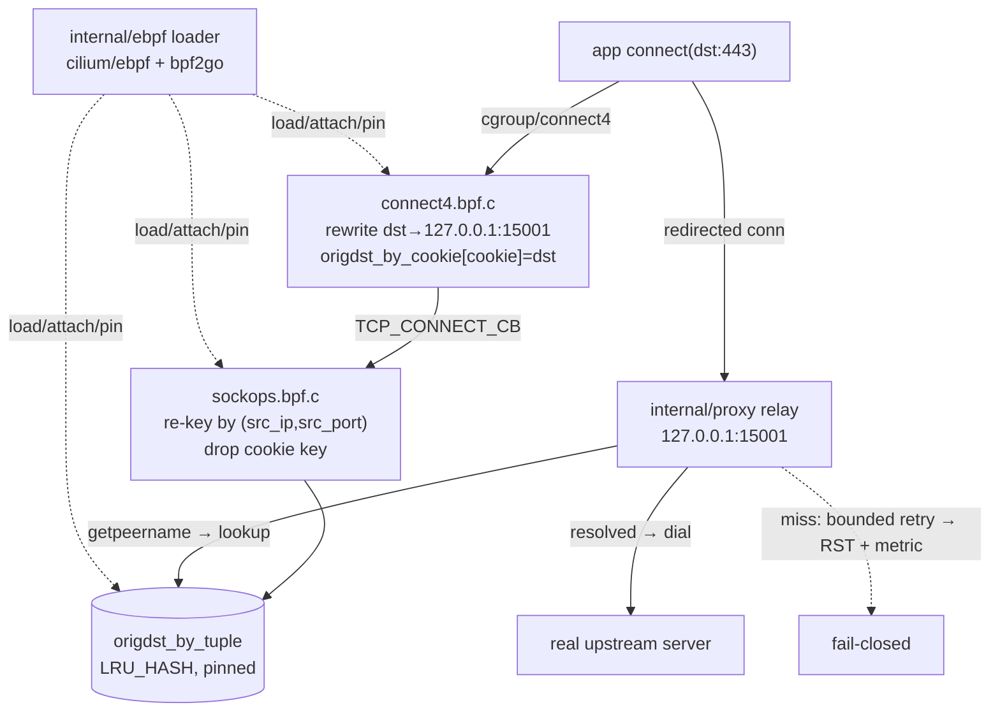

# eBPF Transparent Redirection Design

**Spec**: `.specs/features/01-ebpf-redirect/spec.md`
**Milestone**: M1 — Redirect only
**Status**: Verified (Verifier PASS)

> **Greenfield note**: The workspace scaffold is empty (no `go.mod`, no source). This feature
> establishes the toolchain (Phase 0) that Features 02–03 reuse: `go.mod`, the Makefile from
> [AGENTS.md](../../../AGENTS.md), and `bpf2go` + `vmlinux.h` wiring.

---

## Architecture Overview

Two eBPF programs on the pod parent cgroup cooperate with a Go relay. `connect4` rewrites the
egress destination and records it by socket cookie; `sockops` re-keys it by source tuple before
SYN; the Go relay resolves the original destination via `getpeername()` + tuple-map lookup and
raw-pipes bytes to the real server.



---

## Code Reuse Analysis

### Existing Components to Leverage

| Component | Location | How to Use |
| --------- | -------- | ---------- |
| Logger | `internal/shared/logger/` (empty) | Create the shared structured JSON logger here first; every feature imports it |
| — | — | No other code exists; this milestone sets the conventions |

### Integration Points

| System | Integration Method |
| ------ | ------------------ |
| Kernel cgroup v2 | `cilium/ebpf` `link.AttachCgroup` at the pod parent cgroup |
| bpffs `/sys/fs/bpf` | Pin/unpin maps + programs |
| `internal/proxy` ↔ kernel maps | `bpf2go`-generated map handle read via the loader's map wrapper |

---

## Components

### connect4 eBPF program

- **Purpose**: Rewrite qualifying IPv4 TCP `connect()` destinations to the relay and record the original by cookie.
- **Location**: `bpf/connect4.bpf.c` (+ generated `bpf/*_bpfel.go`)
- **Interfaces**:
  - Program `cgroup_connect4(ctx *bpf_sock_addr): int` — returns 1 (allow) after rewrite
  - Writes `origdst_by_cookie[bpf_get_socket_cookie(ctx)] = {user_ip4, user_port}`
- **Dependencies**: `vmlinux.h`, `PROXY_UID=1337`, `PROXY_PORT=15001` constants
- **Reuses**: N/A (new)

### sockops eBPF program

- **Purpose**: Re-key the original destination from cookie to `(src_ip, src_port)` before SYN.
- **Location**: `bpf/sockops.bpf.c`
- **Interfaces**:
  - Program `sockops_prog(ctx *bpf_sock_ops): int` — acts only on `BPF_SOCK_OPS_TCP_CONNECT_CB`
  - Moves `origdst_by_cookie[cookie]` → `origdst_by_tuple[{src_ip, src_port}]`; deletes cookie key
- **Dependencies**: shared map definitions; byte-order normalisation for `local_port`
- **Reuses**: `connect4`'s map definitions (shared header)

### eBPF loader

- **Purpose**: Load, attach (cgroup), pin, and expose maps to Go; own the lifecycle.
- **Location**: `internal/ebpf/`
- **Interfaces**:
  - `Load(cfg Config) (*Objects, error)` — load `bpf2go` collection
  - `AttachCgroup(cgroupPath string) (io.Closer, error)`
  - `OrigDstByTuple() *ebpf.Map` — map handle for the resolver
  - `Close() error` — detach + unpin
- **Dependencies**: `cilium/ebpf`, generated objects, cgroup self-location via `/proc/self/cgroup`
- **Reuses**: `internal/shared/logger`

### Original-destination resolver

- **Purpose**: `(srcIP, srcPort) → (dstIP, dstPort)` with fail-closed miss policy.
- **Location**: `internal/proxy/resolver.go`
- **Interfaces**:
  - `Resolve(srcIP net.IP, srcPort uint16) (netip.AddrPort, error)` — typed `ErrNotFound`
  - Bounded retry wrapper: N attempts over a few ms, then definitive miss
- **Dependencies**: tuple-map handle; the codec
- **Reuses**: map wrapper from `internal/ebpf`

### Pass-through L4 relay

- **Purpose**: Accept redirected connections, resolve orig-dst, raw-pipe bytes both ways.
- **Location**: `internal/proxy/relay.go`
- **Interfaces**:
  - `ListenAndServe(addr string) error` — listens `127.0.0.1:15001`
  - Per-conn: `getpeername` → `Resolve` → dial → bidirectional `io.Copy`
  - On definitive miss: RST (close), increment miss metric
- **Dependencies**: resolver, logger
- **Reuses**: standard `net` package; logger

### Map codec

- **Purpose**: Marshal/unmarshal `orig_dst` and `tuple_key` matching the C struct layout.
- **Location**: `internal/ebpf/codec.go`
- **Interfaces**: `MarshalTupleKey`, `UnmarshalOrigDst`; byte-order-normalised port
- **Reuses**: `encoding/binary`

---

## Data Models

### BPF maps

```c
struct orig_dst { __u32 ip; __u16 port; };          // network byte order ip
struct tuple_key { __u32 ip; __u16 port; };          // normalised port order

// origdst_by_cookie: LRU_HASH, key __u64 cookie      -> orig_dst  (set by connect4, dropped by sockops)
// origdst_by_tuple:  LRU_HASH, key tuple_key          -> orig_dst  (read by Go relay)
```

**Invariants**: IPv4/`AF_INET` only; Go structs must match `bpf2go` layout exactly (size/offset/padding);
`local_port` (host order in `sockops`) and the Go lookup key resolve to the same byte order.

---

## Error Handling Strategy

| Error Scenario | Handling | User Impact |
| -------------- | -------- | ----------- |
| Tuple lookup miss | Bounded retry, then RST + miss metric + tuple log | Un-redirected conn dropped (fail-closed) |
| Cgroup attach fails (wrong ns) | Fail fast at startup with a clear precondition error | Sidecar exits; operator fixes `--cgroupns=host` |
| Kernel < 5.10 / missing BTF | Fail fast with kernel/Kconfig error | Sidecar refuses to start |
| Map struct drift (CO-RE) | Unit test guards layout; loader errors on mismatch | Caught in CI, not at runtime |
| Upstream dial error | Log `relay_dial_errors`, close conn | Single connection fails, relay stays up |

---

## Risks & Concerns

| Concern | Location (file:line) | Impact | Mitigation |
| ------- | -------------------- | ------ | ---------- |
| Port byte-order mismatch (host vs network) | `bpf/sockops.bpf.c` (new) | Lookup always misses | Normalise in `sockops`; UT-01.3 codec test; IT-01.5 end-to-end |
| Wrong cgroup attach → no intercept or self-loop | `internal/ebpf` (new) | High | Attach at pod parent; whole-sidecar UID 1337 + UID skip; IT-01.4 loop test |
| Greenfield: no toolchain yet | repo root | Blocks all work | Phase 0 establishes `go.mod`, Makefile, `bpf2go`, `vmlinux.h` |
| LRU eviction before `accept()` under churn | `origdst_by_tuple` | Connection fails closed | `sockops` writes before SYN; size the map; bounded retry |

> None hidden — all flagged with mitigations above.

---

## Tech Decisions (feature-local)

| Decision | Choice | Rationale |
| -------- | ------ | --------- |
| Retry budget on miss | Small fixed N over a few ms | Absorbs residual `sockops` race without hanging |
| Relay copy | `io.Copy` both directions in two goroutines | Simplest correct raw pipe; no TLS parsing |
| Metric surface | Counters via logger fields (no APM in MVP) | Matches TDD observability (operator-facing) |

> Project-level decisions already recorded: AD-001, AD-002, AD-003, AD-004, AD-007 in `.specs/STATE.md`.
