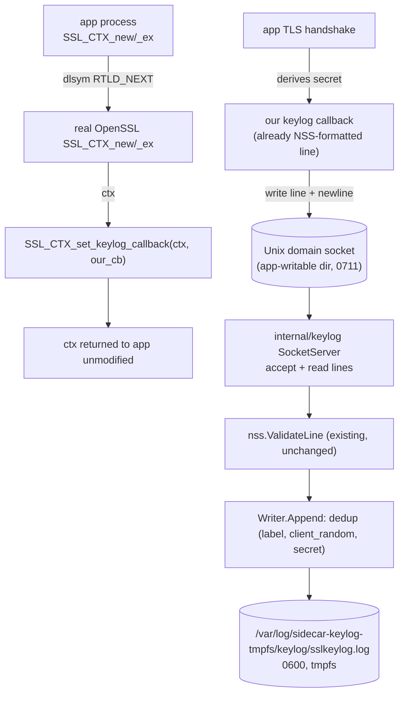

# TLS Session-Key Extraction via LD_PRELOAD Interposer Design

**Spec**: `.specs/features/02-uprobe-keylog/spec.md`
**Milestone**: M2 — Preload keylog
**Status**: Verified (Verifier PASS)

---

## Architecture Overview

A small `LD_PRELOAD` shared library, injected into the app container's process, wraps
`SSL_CTX_new`/`SSL_CTX_new_ex` and registers its own callback with OpenSSL's own
`SSL_CTX_set_keylog_callback`. OpenSSL calls that callback with an already NSS-formatted
line for every derived secret; the interposer ships each line, verbatim, over a Unix
domain socket to the sidecar's socket server, which routes it through the existing
(unchanged) NSS validator, dedup, and secure append writer.



---

## Code Reuse Analysis

### Existing Components to Leverage

| Component | Location | How to Use |
| --------- | -------- | ---------- |
| NSS line validator | `internal/keylog/nss.go` | `ValidateLine` — unchanged, called by the new socket server via `Writer.Append` |
| Secure dedup writer | `internal/keylog/writer.go` | `Writer.Append`/`NewWriter` — unchanged, reused as-is by the new socket server |
| Logger | `internal/shared/logger/` (from F01) | Structured logs for socket accept/reject counts (never secret content) |
| `capture.CheckTarget` pattern | `internal/capture/retention.go` | Adapted (not reused verbatim — see Tech Decisions) for the socket directory's permission guard |

### Removed Components (AD-010)

| Component | Location | Reason |
| --------- | -------- | ------ |
| libssl discovery | `internal/keylog/discovery.go` (+ test) | Uprobe-attach-only; no library/PID resolution needed for a `LD_PRELOAD` interposer |
| OpenSSL offset table | `internal/keylog/openssl_offsets.go` (+ test) | Struct-offset reads are exactly what AD-010 replaces |
| tls_keylog uprobe program | `bpf/tls_keylog.bpf.c` + generated `bpf/tlskeylog_bpfe{l,b}.go` | No uprobe in the new mechanism |
| Ring-buffer event codec | `internal/keylog/event.go` (+ test) | No ring buffer; lines arrive as text over a socket |
| Ring-buffer consumer + uprobe attach | `internal/keylog/consumer.go` (+ tests) | Replaced by `internal/keylog/socket_server.go` |
| GoTLS module | `internal/keylog/gotls.go` (+ test) | Built entirely on the removed `discovery.go`/`AttachSpec`; GoTLS returns to being an undesigned follow-on (no code) |

### Integration Points

| System | Integration Method |
| ------ | ------------------ |
| App's OpenSSL | `LD_PRELOAD` dynamic-linker interposition; `dlsym(RTLD_NEXT, "SSL_CTX_new")` |
| Sidecar ↔ app transport | `net.Listen("unix", path)` / interposer's raw POSIX `socket(AF_UNIX, SOCK_STREAM, 0)` + `connect()` |
| Pod wiring | `deploy/podman/pod-up.sh`: builds the `.so`, creates a shared volume for the socket directory, sets `LD_PRELOAD`/socket-path env vars on the app container only |
| Capture (F03) | Unchanged: `client_random` remains the join key to the captured ClientHello |

---

## Components

### `preload/keylog_preload.c` — the LD_PRELOAD interposer

- **Purpose**: Interpose `SSL_CTX_new`/`SSL_CTX_new_ex`, register a keylog callback, ship
  each formatted line to the sidecar.
- **Location**: `preload/keylog_preload.c`
- **Build**: the `make build-preload` target —
  `$(CC) -shared -fPIC -o preload/libkeylogpreload.so preload/keylog_preload.c -ldl -lssl -lcrypto`
  (`-lssl` is required: the interposer calls `SSL_CTX_set_keylog_callback`, and needs the OpenSSL
  dev headers). Not part of the Go build — the sidecar binary stays CGO-free.
- **Interfaces**:
  - `SSL_CTX *SSL_CTX_new(const SSL_METHOD *method)` / `SSL_CTX_new_ex(...)` — call through
    via `dlsym(RTLD_NEXT, ...)`, then `SSL_CTX_set_keylog_callback(ctx, keylog_cb)`
  - `static void keylog_cb(const SSL *ssl, const char *line)` — the OpenSSL callback;
    writes `line` + `"\n"` to the (lazily opened, cached) socket fd
  - Socket path read once from `getenv("GOEBPF_PRELOAD_SOCKET")`; if unset, the interposer
    is a pure no-op (callback registered but never sends anywhere — logs nothing, exits
    cleanly, never crashes the app)
- **Dependencies**: `libdl` (`dlsym`), POSIX sockets (`sys/socket.h`, `sys/un.h`)
- **Reuses**: N/A (new); mirrors the well-known `SSLKEYLOGFILE`/curl `LD_PRELOAD` pattern

### `internal/keylog/socket_server.go` — sidecar-side transport

- **Purpose**: Accept interposer connections, read newline-delimited NSS lines, route each
  through the existing validate→dedup→append pipeline.
- **Location**: `internal/keylog/socket_server.go`
- **Interfaces**:
  - `type SocketServerConfig struct { SocketPath string; KeylogPath string }`
  - `NewSocketServer(cfg SocketServerConfig, opts ...SocketServerOption) (*SocketServer, error)` — creates the socket
    directory (`0711`) if missing, applies the permission guard, removes a stale socket
    file, `net.Listen("unix", path)`, `os.Chmod(path, 0666)`, opens the `Writer`
  - `(*SocketServer) Run() error` — accept loop; one goroutine per connection, `bufio.Scanner`
    reads lines, each routed to `Writer.Append`; a malformed line increments a rejection
    counter and is logged **without** its content
  - `(*SocketServer) Close() error` — closes the listener, the writer, removes the socket file
- **Dependencies**: `net`, `bufio`, `internal/shared/logger`
- **Reuses**: `Writer` (`writer.go`, unchanged), `ValidateLine` (`nss.go`, unchanged, via `Writer.Append`)

### `internal/keylog/preload_env.go` — preload env builder

- **Purpose**: Produce the exact env vars the app container needs.
- **Location**: `internal/keylog/preload_env.go`
- **Interfaces**: `PreloadEnv(soPath, socketPath string) []string` → `["LD_PRELOAD=" + soPath, "GOEBPF_PRELOAD_SOCKET=" + socketPath]`
- **Reuses**: N/A (new)

---

## Data Models

### Wire protocol (interposer → sidecar)

Plain newline-delimited text — no framing, no binary struct, identical grammar to the NSS
keylog file itself:

```text
<LABEL> <client_random_hex(64)> <secret_hex(64|96)>\n
```

Each line is independently valid; the sidecar treats the socket as a stream of these lines
via `bufio.Scanner`, so a slow/partial write is simply buffered until the newline arrives.

### NSS keylog line (on disk) — unchanged

```text
CLIENT_RANDOM <64 hex> <96 hex>                       # TLS 1.2, 48-byte master secret
CLIENT_HANDSHAKE_TRAFFIC_SECRET <64 hex> <64|96 hex>   # TLS 1.3 (x5 labels)
```

---

## Error Handling Strategy

| Error Scenario | Handling | User Impact |
| --------------- | -------- | ----------- |
| App never links OpenSSL dynamically / static libssl | Interposer's wrapped symbols never called | No lines, no crash, no error surfaced |
| `GOEBPF_PRELOAD_SOCKET` unset | Interposer callback still registers but no-ops on send | No lines, no crash |
| Interposer can't connect / write fails | Bounded retry (few attempts, short backoff), then silently drop that line, reconnect lazily on the next one | App never blocks on a diagnostic side-channel |
| Malformed line received by the socket server | `Writer.Append`'s `ValidateLine` rejects it; rejection counter logged, content never logged | Keylog stays valid; no secret leakage via logs |
| Socket directory world-writable/readable (misconfiguration) | `NewSocketServer` refuses to listen (`perm&0o066 != 0`) | Fails fast and loud instead of running an unsafe transport |
| Connection closes mid-line | Partial buffered bytes without a newline are discarded when the connection ends; no partial append | Keylog never gains a corrupted/truncated line |
| Duplicate `(label, client_random, secret)` | `Writer.Append`'s existing dedup set collapses it | Idempotent under interposer/callback re-fires |

---

## Risks & Concerns

| Concern | Location (file:line) | Impact | Mitigation |
| ------- | --------------------- | ------ | ---------- |
| Cross-UID socket permissions (app UID ≠ sidecar UID 1337) | `internal/keylog/socket_server.go` (new) | High | `0711` dir + `chmod 0666` on the socket file; volume is pod-exclusive (not the host, not other pods) |
| Interposer never loaded (env stripped, `setuid` binary) | `preload/keylog_preload.c` (new), `deploy/podman/pod-up.sh` | Medium | Documented constraint; pod controls the app container's launch env directly |
| Socket unreachable at the app's first handshake (race) | `internal/keylog/socket_server.go` (new) | Medium | Sidecar starts the socket server before the app container starts (pod-up.sh ordering, already true for the pod's containers) |
| Interposer callback re-entrancy/thread-safety (OpenSSL may call from multiple threads) | `preload/keylog_preload.c` (new) | Medium | Guard the cached socket fd with a small mutex around connect/write |
| Secret leakage via logs | `internal/keylog/socket_server.go` (new) | High | Never log line content; only counts/events (same discipline as `writer.go`) |

> None hidden — all flagged with mitigations above.

---

## Tech Decisions (feature-local)

| Decision | Choice | Rationale |
| -------- | ------ | --------- |
| Socket directory guard vs. `capture.CheckTarget` | Reject `perm&0o066 != 0` (no write/read for group/other), not the stricter `perm&0o077 != 0` | The socket must be traversable by a different (app) UID; `capture.CheckTarget`'s `0700` is for at-rest secret *files*, not a live cross-UID IPC rendezvous point |
| Interposer language/build | C, `clang`/`gcc -shared -fPIC`, no CGO in the Go binary | Matches the existing eBPF C toolchain; keeps the sidecar binary CGO-free (AD-007) |
| Callback registration point | `SSL_CTX_new`/`SSL_CTX_new_ex` only (not per-`SSL*`) | `SSL_CTX_set_keylog_callback` is inherited by every `SSL*` created from that context — one registration point covers all connections |
| Socket protocol | Raw newline-delimited text, no length-prefix framing | Lines are already newline-free (hex + spaces); a `bufio.Scanner` is sufficient and this exactly matches the on-disk NSS grammar |

> Project-level decisions already recorded: AD-006, AD-007, AD-008, AD-010 in `.specs/STATE.md`.
