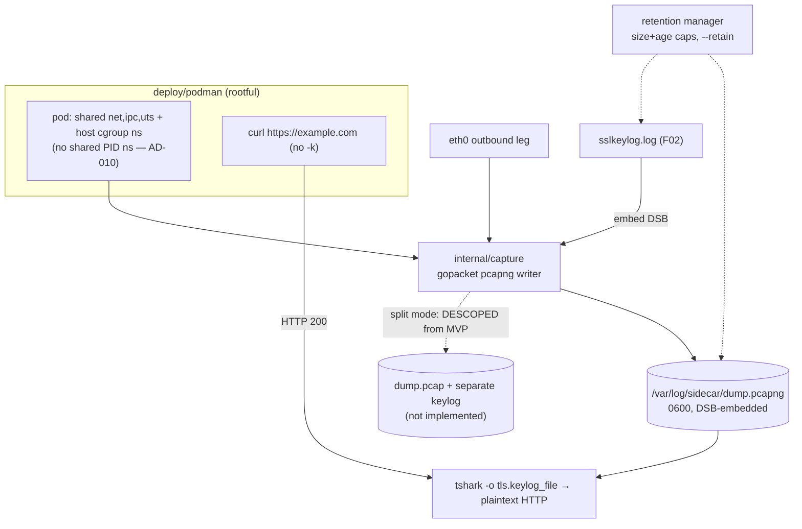

# Capture & Offline Decryption Validation Design

**Spec**: `.specs/features/03-capture-harness/spec.md`
**Milestone**: M3 — Capture harness
**Status**: Verified (Verifier PASS)

---

## Architecture Overview

An in-process gopacket writer captures the outbound leg to pcapng and embeds the LD_PRELOAD-interposer-emitted
keylog (AD-010) as a Decryption Secrets Block (DSB) so the file self-decrypts. A retention manager keeps
artifacts secret-grade and bounded. A rootful Podman harness brings up the app+sidecar pod and a
smoke test proves the pipeline end-to-end; offline `tshark` validates decryption.



---

## Code Reuse Analysis

### Existing Components to Leverage

| Component | Location | How to Use |
| --------- | -------- | ---------- |
| Keylog writer | `internal/keylog/` (from F02) | Source of the NSS lines embedded as a DSB |
| eBPF loader + relay | `internal/ebpf/`, `internal/proxy/` (from F01) | The harness attaches these; capture wraps the same run |
| Logger | `internal/shared/logger/` (from F01) | Operational telemetry (bytes, rotation) — never secrets |

### Integration Points

| System | Integration Method |
| ------ | ------------------ |
| `eth0` | **Current**: `pcapgo.EthernetHandle` (non-mmap AF_PACKET socket, `SetCaptureLength(65536)`); `tcpdump` fallback. **Planned**: gopacket `afpacket` (TPACKET_V3 mmap ring) to bound segment loss — see CAPTURE-04 / AD-012 |
| pcapng DSB | `pcapgo` NgWriter with a Decryption Secrets Block from the keylog |
| Podman | `deploy/podman` create/run scripts (caps, mounts, namespaces) |
| tshark | `-o tls.keylog_file:<path>` pairing invocation |

---

## Components

### pcapng capture writer

- **Purpose**: Write the outbound leg to a valid pcapng with an embedded DSB.
- **Location**: `internal/capture/pcapng.go`
- **Interfaces**:
  - `NewWriter(path string, opts Options) (*Writer, error)` — SHB/IDB, correct `LinkType`
  - `WritePacket(ci gopacket.CaptureInfo, data []byte) error`
  - `EmbedKeylog(lines []string) error` — DSB block
- **Dependencies**: `gopacket`, `pcapgo` (`afpacket` is **not** a current dependency — planned for the CAPTURE-04 fix, see AD-012)
- **Reuses**: keylog lines from `internal/keylog`

### tcpdump fallback backend

- **Purpose**: Alternative capture backend for parity.
- **Location**: `internal/capture/tcpdump.go`
- **Interfaces**: `Start(iface, path string) (stop func() error, err error)` — dispatches to `startTcpdump`/`startGopacket`
- **Reuses**: `os/exec`

### Clock source

- **Purpose**: Single monotonic clock shared by capture + keylog for aligned timestamps.
- **Location**: `internal/capture/clock.go`
- **Interfaces**: `Now() time.Time` injected into both writers
- **Reuses**: `time`

### Retention manager

- **Purpose**: Enforce size + age caps, rotation, and ephemeral-by-default cleanup.
- **Location**: `internal/capture/retention.go`
- **Interfaces**:
  - `Enforce() error` — evict oldest-first when either cap is hit
  - `Cleanup() error` — wipe `/var/log/sidecar` unless the struct's `Retain` field is set (`--retain`)
  - permission guard: refuse to write under a world-accessible target
- **Reuses**: `os`, logger

### tshark pairing helper

- **Purpose**: Emit the correct offline-decryption invocation.
- **Location**: `internal/capture/pairing.go`
- **Interfaces**: `TsharkArgs(pcap, keylog string) []string` → `-o tls.keylog_file:<path>`
- **Reuses**: N/A

### Podman harness

- **Purpose**: Bring up the pod with correct namespaces, caps, and mounts; smoke test.
- **Location**: `deploy/podman/` (`pod-up.sh`, `pod-down.sh`, `smoke.sh`)
- **Interfaces**: shell scripts — pod create/run, `curl` smoke, teardown (default wipe / `--retain`)
- **Reuses**: F01/F02 sidecar binary from `cmd/app`

### Entrypoint wiring

- **Purpose**: Wire load+attach (cgroup `connect4`/`sockops`), relay, keylog socket server, and capture together.
- **Location**: `cmd/app/main.go`
- **Interfaces**: CLI flags (`--cgroup-path`, `--relay-listen`, `--pin-dir`, `--keylog-socket`, `--keylog-path`, `--capture-iface`, `--capture-path`, `--retain`, `--max-bytes`, `--max-age`, `--retention-interval`); orchestrates all packages
- **Reuses**: everything above

---

## Data Models

### Capture artifacts (on disk)

```text
/var/log/sidecar/
  dump.pcapng      # pcapng + embedded DSB (self-decrypting), 0600
  (dir mode 0700, owner UID 1337)

/var/log/sidecar-keylog-tmpfs/keylog/
  sslkeylog.log    # NSS keylog on tmpfs, 0600 (dir 0700)

# The split `pcap + separate keylog` mode is DESCOPED from the MVP (no code path).
```

### Retention config

```go
type Retention struct {
    MaxBytes int64         // size cap
    MaxAge   time.Duration // age cap
    Retain   bool          // --retain disables purge
}
```

---

## Error Handling Strategy

| Error Scenario | Handling | User Impact |
| -------------- | -------- | ----------- |
| Timestamp skew capture vs keylog | Single injected clock; IT-03.2 negative test | Reliable decryption |
| `tcpdump` unavailable | Fall back to in-process gopacket | Capture still works |
| Keylog dir missing | Create `0700` before writing | No world-readable secrets |
| World-accessible write target | Refuse to write | Prevents secret exposure |
| Size/age cap reached | Rotate/evict oldest-first | Bounded footprint |
| Pod missing host cgroup ns | Harness fails fast with precondition error | Clear operator fix |

---

## Risks & Concerns

| Concern | Location (file:line) | Impact | Mitigation |
| ------- | -------------------- | ------ | ---------- |
| Capture/keylog timestamp skew | `internal/capture/clock.go` (new) | Decryption fails | Single clock source; DSB embeds keylog; IT-03.2 |
| Plaintext-equivalent secrets on disk | `internal/capture/retention.go` (new) | High | tmpfs keylog, `0600`/`0700`, bounded + ephemeral; AD-006 |
| Rootful privileges / broad caps | `deploy/podman/` | Medium | `--cap-drop ALL` then `CAP_BPF`+`CAP_NET_ADMIN`+`CAP_SYS_RESOURCE`+`CAP_NET_RAW` only (no `CAP_PERFMON` — AD-010; no `SYS_ADMIN`). AppArmor/seccomp unconfined on the sidecar only (AD-009) |
| Backend divergence (tcpdump vs gopacket) | `internal/capture/` (new) | Medium | Parity test IT-03.3 asserts identical decrypted app-data |
| Capture loss under load | `internal/capture/pcapng.go` | Medium | **Unresolved (CAPTURE-04)**: the affected e2e test retries-then-skips, never false-passes. Planned fix: mmap'd AF_PACKET ring (`gopacket/afpacket`) — AD-012. An in-kernel `SetBPF` filter was attempted and reverted (it stopped capture mid-connection) |

> None hidden — all flagged with mitigations above.

---

## Tech Decisions (feature-local)

| Decision | Choice | Rationale |
| -------- | ------ | --------- |
| Default artifact | DSB-embedded single pcapng | Self-decrypting; simplest to hand off |
| Split mode | **Descoped from MVP** (no code path) — was to be an opt-in `pcap + separate keylog` | Independent retention of ciphertext vs secrets; deferred to a follow-on |
| Harness form | Shell scripts under `deploy/podman` | Matches TDD; `podman generate kube` is post-MVP |

> Project-level decisions already recorded: AD-005, AD-006, AD-007 in `.specs/STATE.md`.
