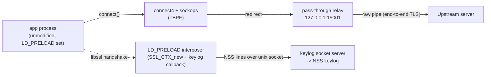
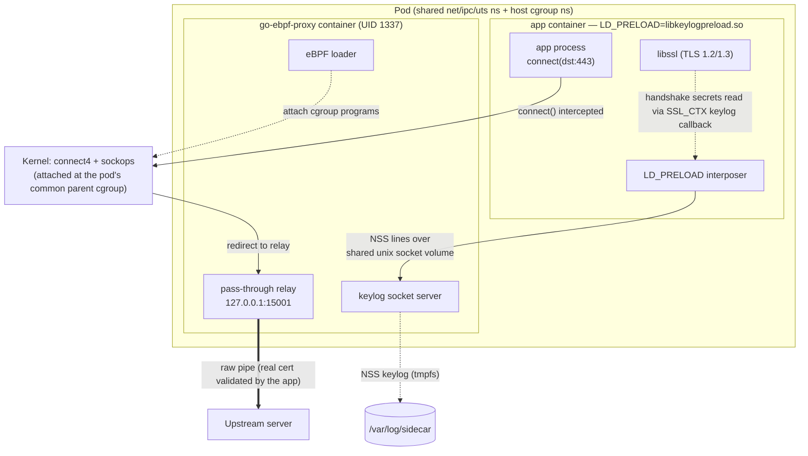

# GO-eBPF-Proxy

A sidecar that transparently redirects an unmodified application's outbound IPv4 TCP
egress to a local pass-through relay using eBPF (`cgroup/connect4`, no `iptables`/NAT),
and **passively extracts the app's TLS session keys via an `LD_PRELOAD` interposer** on
its OpenSSL library — emitting an NSS-format keylog so the captured (still end-to-end
encrypted) TLS 1.2/1.3 traffic can be decrypted and inspected offline.

**No TLS termination. No MITM. No CA.** The app's handshake stays end-to-end with the
real server; its certificate validation is never weakened, so certificate pinning is a
non-issue — the sidecar only reads the ephemeral keys the app's own TLS library already
derives.

## Why

Inspecting an app's encrypted egress usually means one of three intrusive options:
instrumenting the app, relying on `iptables`/NAT (often blocked by policy), or a MITM CA
(defeated by certificate pinning, and TLS 1.3 forward secrecy makes static-key decryption
impossible anyway). `go-ebpf-proxy` avoids all three: transparent redirection at the
socket layer, and TLS keys read passively from the process that already holds them.

## How it works

1. An eBPF `cgroup/connect4` program intercepts `connect()`, records the original
   destination, and rewrites it to a local relay (`127.0.0.1:15001`).
2. A `sockops` program re-keys that record by source tuple so the relay can recover it
   race-free after `accept()`.
3. The Go relay resolves the original destination and raw-pipes bytes both directions —
   it never parses or terminates TLS.
4. A small `LD_PRELOAD` interposer (`preload/libkeylogpreload.so`), loaded into the app
   container's environment, wraps `SSL_CTX_new`/`SSL_CTX_new_ex` and registers an
   OpenSSL keylog callback, so it observes `client_random` and the TLS 1.2/1.3 session
   secrets as the app's own libssl derives them, and ships each line over a Unix domain
   socket to the sidecar.
5. The sidecar's socket server reads those lines, validates and deduplicates them, and
   writes them as an NSS keylog (`/var/log/sidecar/sslkeylog.log`), which Wireshark/tshark
   can pair with a capture of the same egress to show decrypted traffic.



## Pod view

`go-ebpf-proxy` runs as a second container in the same pod as the target app, sharing its
network, IPC and UTS namespaces plus the host's cgroup namespace (no shared PID
namespace — the interposer needs no PID/inode resolution). **Any app container that
links OpenSSL's `libssl` and has the interposer's `LD_PRELOAD`/`GOEBPF_PRELOAD_SOCKET`
env vars set gets transparent redirection and TLS key extraction** — no app code
change, no rebuild, no trust-store edit.



Swap in a different app container image — same or different language, any process that
links `libssl` and carries the interposer env vars — and the sidecar keeps working
unchanged: the `connect4`/`sockops` programs redirect at the socket layer regardless of
what wrote the syscall, and the interposer hooks the *library*, not any particular app
binary.

> **Historical note**: an earlier design (M2) extracted TLS keys via an eBPF uprobe on
> `libssl`, requiring a shared PID namespace and `CAP_PERFMON`. AD-010 replaced it with
> the `LD_PRELOAD` interposer described above — no uprobe, no shared PID namespace.

## Status

MVP delivered in three vertical slices:

| Milestone | Scope | Status |
| --- | --- | --- |
| M1 | eBPF transparent redirect (`connect4` + `sockops` + pass-through relay) | ✅ Done |
| M2 | TLS keylog extraction (OpenSSL, via the `LD_PRELOAD` interposer) | ✅ Done |
| M3 | Capture (pcapng + Podman dev environment + decrypt validation) | ✅ Done |

## Requirements

- Linux kernel ≥ 5.10 (BTF/CO-RE, BPF ring buffer)
- `CAP_BPF` + `CAP_NET_ADMIN`
- Go ≥ 1.25, `clang`/`llvm` ≥ 14 and `bpftool` (for building the eBPF programs), a C
  compiler + OpenSSL headers (for building the `LD_PRELOAD` interposer)
- Rootful Podman (local dev setup)

## Build & test

```bash
make build             # fmt -> vet -> build
make build-preload      # build the LD_PRELOAD keylog interposer (.so)
make test               # unit tests (go test -race ./...)
make test-integration   # kernel/eBPF-backed tests (build tag `integration`; skip cleanly
                        # without the required capabilities)
make lint               # golangci-lint, covers unit and integration-tagged files
make check              # lint + build + test + test-integration
```

eBPF objects are pre-generated and committed (`bpf/*_bpfel.go`, `*_bpfeb.go`). To
regenerate them after editing a `.bpf.c` file:

```bash
make generate
```

## Project layout

```
bpf/             eBPF C programs (connect4, sockops) + generated bindings
internal/ebpf/   loader: load/attach/pin the eBPF programs, map codec
internal/proxy/  original-dst resolver (fail-closed) + pass-through L4 relay
internal/keylog/ keylog socket server, NSS keylog validation/writer, preload env builder
preload/         LD_PRELOAD interposer (C): hooks SSL_CTX_new, ships keylog lines
internal/shared/ structured logging, shared infra
cmd/app/         sidecar entrypoint (wires loader, relay, keylog socket server, capture)
deploy/podman/   rootful Podman dev environment (pod scripts)
```

## Out of scope (MVP)

`sockmap`/`sk_msg` acceleration; IPv6 (`connect6`); UDP/QUIC/HTTP-3; production Kubernetes; live in-band DPI; the TUI; TLS-library modules beyond OpenSSL (BoringSSL/GnuTLS/NSS/GoTLS are interface-only).

## Skills reference

- [tlc-spec-driven](https://agent-skills.techleads.club/skills/tlc-spec-driven/): Plan and implement the features.
- [technical-design-doc-creator](https://agent-skills.techleads.club/skills/technical-design-doc-creator/): Create (and maintain) the technical design document based on previous researches, decisions and plans.
- [skill-taskwarrior](https://github.com/mesbrj/skills#skill-taskwarrior): Manage and track the human tasks/activities.

## License

GPL-3.0 — see [LICENSE](LICENSE).
