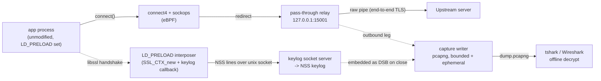
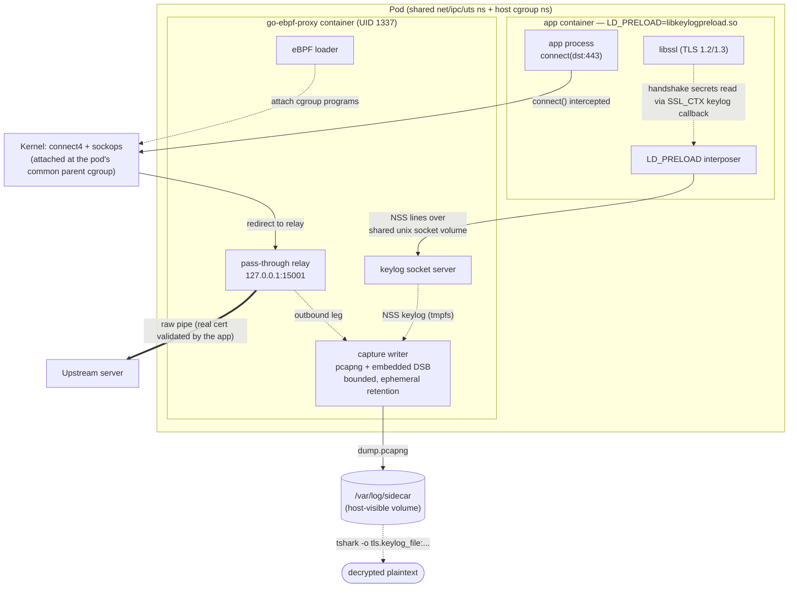

# GO-eBPF-Proxy

A sidecar that transparently redirects an unmodified application's outbound IPv4 TCP
egress to a local pass-through relay using eBPF (`cgroup/connect4`, no `iptables`/NAT),
**passively extracts the app's TLS session keys via an `LD_PRELOAD` interposer** on
its OpenSSL library, and **captures the same egress to a DSB-embedded pcapng** so the
still end-to-end encrypted TLS 1.2/1.3 traffic can be decrypted and inspected offline
with Wireshark/tshark. The Podman scripts under `deploy/podman/` bring up a complete
app+sidecar pod end-to-end (see [Quick start](#quick-start)).

**No TLS termination. No MITM. No CA.** The app's handshake stays end-to-end with the
real server; its certificate validation is never weakened, so certificate pinning is a
non-issue — the sidecar only reads the ephemeral keys the app's own TLS library already
derives.

## Why

Inspecting an app's encrypted egress usually means one of three intrusive options:
instrumenting the app, relying on `iptables`/NAT (often blocked by policy), or a MITM CA
(defeated by certificate pinning, and TLS 1.3 forward secrecy makes static-key decryption
impossible anyway). `go-ebpf-proxy` avoids all three: transparent redirection at the
socket layer, and TLS keys read passively from the process that already holds them.

## How it works

1. An eBPF `cgroup/connect4` program intercepts `connect()`, records the original
   destination, and rewrites it to a local relay (`127.0.0.1:15001`).
2. A `sockops` program re-keys that record by source tuple so the relay can recover it
   race-free after `accept()`.
3. The Go relay resolves the original destination and raw-pipes bytes both directions —
   it never parses or terminates TLS.
4. A small `LD_PRELOAD` interposer (`preload/libkeylogpreload.so`), loaded into the app
   container's environment, wraps `SSL_CTX_new`/`SSL_CTX_new_ex` and registers an
   OpenSSL keylog callback, so it observes `client_random` and the TLS 1.2/1.3 session
   secrets as the app's own libssl derives them, and ships each line over a Unix domain
   socket to the sidecar.
5. The sidecar's socket server reads those lines, validates and deduplicates them, and
   writes them as an NSS keylog (on tmpfs, `0600`/`0700`).
6. The sidecar also captures the relay's outbound leg to a pcapng file, in-process
   (gopacket reading an `AF_PACKET` socket — no libpcap or external capture tool),
   embedding the keylog as a Decryption Secrets Block on close — the capture is
   self-decrypting.
   Retention is bounded (size + age caps) and ephemeral by default: pod teardown wipes
   the capture directory unless `--retain` is set.
7. Offline, `tshark`/Wireshark pairs the pcapng (or its embedded DSB) with the keylog to
   show the app's real traffic in plaintext — proving the whole pipeline end-to-end.



## Pod view

`go-ebpf-proxy` runs as a second container in the same pod as the target app, sharing its
network, IPC and UTS namespaces plus the host's cgroup namespace (no shared PID
namespace — the interposer needs no PID/inode resolution). **Any app container that
links OpenSSL's `libssl` and has the interposer's `LD_PRELOAD`/`GOEBPF_PRELOAD_SOCKET`
env vars set gets transparent redirection and TLS key extraction** — no app code
change, no rebuild, no trust-store edit.



Swap in a different app container image — same or different language, any process that
links `libssl` and carries the interposer env vars — and the sidecar keeps working
unchanged: the `connect4`/`sockops` programs redirect at the socket layer regardless of
what wrote the syscall, and the interposer hooks the *library*, not any particular app
binary.

## Requirements

- Linux kernel ≥ 5.10 (BTF/CO-RE)
- `CAP_BPF`, `CAP_NET_ADMIN`, `CAP_SYS_RESOURCE` (raises `RLIMIT_MEMLOCK` on eBPF load)
  and `CAP_NET_RAW` (opens the capture socket) — on the sidecar container only
- Go ≥ 1.25, `clang`/`llvm` ≥ 14 and `bpftool` (for building the eBPF programs), a C
  compiler + OpenSSL headers (for building the `LD_PRELOAD` interposer)
- Rootful Podman (local dev setup)
- Supported platforms: Ubuntu 24.04 LTS is the reference platform — see the
  [technical design document](https://curious-quince-eb8.notion.site/Techinical-Design-Document-3e08ea6a94c880cc9dfccc6fd2fed274#3e18ea6a94c8802d8e5de603f8f49b0e) for the full supported-platform matrix
- `tshark` (optional, only needed to run the offline decrypt step in [Quick start](#quick-start))

## Quick start

Brings up the real app+sidecar pod, proves a real end-to-end TLS 1.3 request through the
relay, and decrypts the resulting capture offline. Requires a rootful Linux host with
`podman` (see Requirements above); the pod scripts must run as root.

```bash
# 1. Build the sidecar binary (statically by default, for the musl/alpine sidecar
#    image) and the LD_PRELOAD interposer
make build
make build-preload

# 2. Bring up the pod: sidecar (eBPF redirect + keylog + capture) then the app,
#    wired with LD_PRELOAD/GOEBPF_PRELOAD_SOCKET automatically
sudo deploy/podman/pod-up.sh

# 3. Prove it end-to-end: a real HTTPS request through the relay, real cert validated
sudo deploy/podman/smoke.sh
# smoke: https://example.com -> HTTP 200

# 4. Decrypt the capture offline, pairing it with the interposer-emitted keylog
podman cp go-ebpf-proxy-sidecar:/var/log/sidecar-keylog-tmpfs/keylog/sslkeylog.log /tmp/sslkeylog.log
tshark -r "$(podman volume inspect go-ebpf-proxy-sidecar-logs --format '{{.Mountpoint}}')/dump.pcapng" \
  -o "tls.keylog_file:/tmp/sslkeylog.log" -o tcp.reassemble_out_of_order:TRUE \
  -Y 'http or http2' -V
# -Y 'http or http2' matches whichever protocol the session negotiated over ALPN:
# curl picks HTTP/2, which tshark dissects with a separate "http2" dissector that
# a plain "http" filter never matches.
# -o tcp.reassemble_out_of_order:TRUE reassembles TCP segments the capture recorded
# out of sequence, which tshark does not do by default.
# -V (full protocol detail) is required to see the actual decrypted body text --
# -Y alone only prints a one-line protocol summary per matching packet.

# 5. Tear down — wipes /var/log/sidecar by default; add --retain to keep the capture/keylog
sudo deploy/podman/pod-down.sh
```

`POD_NAME`, `APP_IMAGE`, `CAPTURE_IFACE` and friends are all overridable env vars on
`pod-up.sh` (see the script header); the smoke test targets `URL=${URL:-https://example.com}`.

## Build & test

```bash
make build             # fmt -> vet -> build
make build-preload      # build the LD_PRELOAD keylog interposer (.so)
make test               # unit tests (go test -race ./...)
make test-integration   # kernel/eBPF-backed tests (build tag `integration`; skip cleanly
                        # without the required capabilities)
make lint               # golangci-lint, covers unit and integration-tagged files
make check              # lint + build + test + test-integration
```

eBPF objects are pre-generated and committed (`bpf/*_bpfel.go`, `*_bpfeb.go`). To
regenerate them after editing a `.bpf.c` file:

```bash
make generate
```

## Project layout

```text
bpf/             eBPF C programs (connect4, sockops) + generated bindings
internal/ebpf/   loader: load/attach/pin the eBPF programs, map codec
internal/proxy/  original-dst resolver (fail-closed) + pass-through L4 relay
internal/keylog/ keylog socket server, NSS keylog validation/writer
internal/capture/ live AF_PACKET capture, pcapng writer + embedded DSB, retention
internal/capture/capturetest/ tshark offline-decryption check (test support only)
preload/         LD_PRELOAD interposer (C): hooks SSL_CTX_new, ships keylog lines
internal/shared/ structured logging, shared infra
cmd/app/         sidecar entrypoint (wires loader, relay, keylog socket server, capture)
deploy/podman/   rootful Podman dev environment (pod scripts)
```

## Out of scope (MVP)

`sockmap`/`sk_msg` acceleration; IPv6 (`connect6`); UDP/QUIC/HTTP-3; production Kubernetes; live in-band: DPI, IPFIX export; the TUI; TLS-library modules beyond OpenSSL (BoringSSL/GnuTLS/NSS/GoTLS are interface-only).

## Project Documentation

[GO-eBPF-Proxy - Public Docs](https://curious-quince-eb8.notion.site/GO-eBPF-Proxy-Public-3e08ea6a94c8801e9083e63fc0773810)

## Skills reference

- [tlc-spec-driven](https://agent-skills.techleads.club/skills/tlc-spec-driven/)
- [technical-design-doc-creator](https://agent-skills.techleads.club/skills/technical-design-doc-creator/)
- [skill-taskwarrior](https://github.com/mesbrj/skills#skill-taskwarrior)

## License

GPL-3.0 — see [LICENSE](LICENSE).
