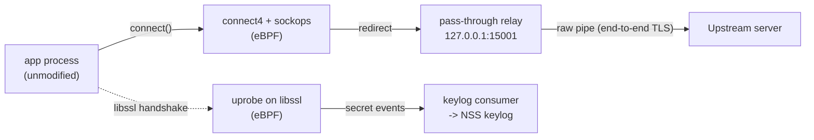

# GO-eBPF-Proxy

A sidecar that transparently redirects an unmodified application's outbound IPv4 TCP
egress to a local pass-through relay using eBPF (`cgroup/connect4`, no `iptables`/NAT),
and **passively extracts the app's TLS session keys via eBPF uprobes** on its TLS
library — emitting an NSS-format keylog so the captured (still end-to-end encrypted)
TLS 1.2/1.3 traffic can be decrypted and inspected offline.

**No TLS termination. No MITM. No CA.** The app's handshake stays end-to-end with the
real server; its certificate validation is never weakened, so certificate pinning is a
non-issue — the sidecar only reads the ephemeral keys the app's own TLS library already
derives.

## Why

Inspecting an app's encrypted egress usually means one of three intrusive options:
instrumenting the app, relying on `iptables`/NAT (often blocked by policy), or a MITM CA
(defeated by certificate pinning, and TLS 1.3 forward secrecy makes static-key decryption
impossible anyway). `go-ebpf-proxy` avoids all three: transparent redirection at the
socket layer, and TLS keys read passively from the process that already holds them.

## How it works

1. An eBPF `cgroup/connect4` program intercepts `connect()`, records the original
   destination, and rewrites it to a local relay (`127.0.0.1:15001`).
2. A `sockops` program re-keys that record by source tuple so the relay can recover it
   race-free after `accept()`.
3. The Go relay resolves the original destination and raw-pipes bytes both directions —
   it never parses or terminates TLS.
4. An eBPF uprobe on the app's TLS library (`libssl`) reads `client_random` and the TLS
   1.2/1.3 session secrets as the library derives them, and streams them to user space
   over a ring buffer.
5. The secrets are validated, deduplicated, and written as an NSS keylog
   (`/var/log/sidecar/sslkeylog.log`), which Wireshark/tshark can pair with a capture of
   the same egress to show decrypted traffic.



## Status

MVP delivered in three vertical slices:

| Milestone | Scope | Status |
| --- | --- | --- |
| M1 | eBPF transparent redirect (`connect4` + `sockops` + pass-through relay) | ✅ Done |
| M2 | Uprobe TLS keylog extraction (OpenSSL) | ✅ Done |
| M3 | Capture harness (pcapng + Podman dev harness + decrypt validation) | ⏳ Planned |

## Requirements

- Linux kernel ≥ 5.10 (BTF/CO-RE, uprobes, BPF ring buffer)
- `CAP_BPF` + `CAP_NET_ADMIN` + `CAP_PERFMON`
- Go ≥ 1.25, `clang`/`llvm` ≥ 14 and `bpftool` (for building the eBPF programs)
- Rootful Podman (dev harness); a shared PID namespace is required so the sidecar can
  resolve and attach uprobes to the app's TLS library

## Build & test

```bash
make build             # fmt -> vet -> build
make test               # unit tests (go test -race ./...)
make test-integration   # kernel/eBPF-backed tests (build tag `integration`; skip cleanly
                        # without the required capabilities)
make lint               # golangci-lint, covers unit and integration-tagged files
make check              # lint + build + test + test-integration
```

eBPF objects are pre-generated and committed (`bpf/*_bpfel.go`, `*_bpfeb.go`). To
regenerate them after editing a `.bpf.c` file:

```bash
make generate
```

## Project layout

```
bpf/             eBPF C programs (connect4, sockops, tls_keylog) + generated bindings
internal/ebpf/   loader: load/attach/pin the eBPF programs, map codec
internal/proxy/  original-dst resolver (fail-closed) + pass-through L4 relay
internal/keylog/ TLS library discovery, uprobe attach, NSS keylog extraction/writer
internal/shared/ structured logging, shared infra
cmd/app/         sidecar entrypoint (wires loader, relay, keylog)
deploy/podman/   rootful Podman dev harness
```

## Out of scope (MVP)

MITM TLS termination and a forging CA; `sockmap`/`sk_msg` acceleration; IPv6
(`connect6`); UDP/QUIC/HTTP-3; production Kubernetes; live in-band DPI; the TUI;
TLS-library modules beyond OpenSSL (BoringSSL/GnuTLS/NSS/GoTLS are interface-only).

## License

GPL-3.0 — see [LICENSE](LICENSE).
