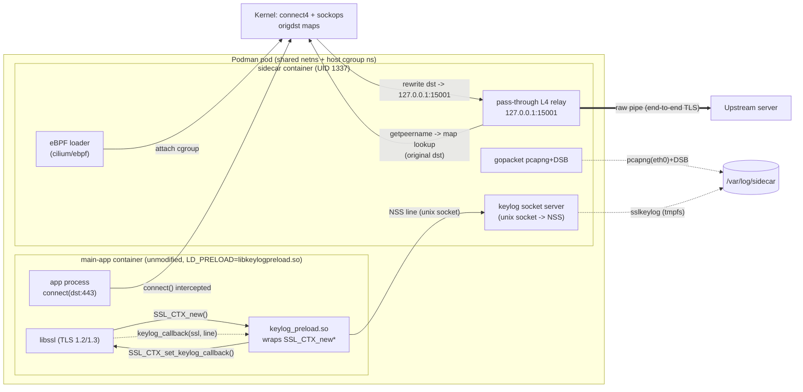

# TDD — go-ebpf-proxy (eBPF transparent redirection + passive `LD_PRELOAD` TLS keylog sidecar)

| Field           | Value                                                        |
| --------------- | ----------------------------------------------------------- |
| Tech Lead       | mesbrj                                                      |
| Product Manager | mesbrj                                                      |
| Team            | MESBRJ HOME LABs                                            |
| Epic/Ticket     | taskwarrior project: Go-eBPF-Proxy                                               |
| Design/Refs     | [PRD](prd/product-requirements-document.md), [Feasibility study](feasibility-study.md), [Feature 01](prd/feature-01.md), [Feature 02](prd/feature-02.md), [Feature 03](prd/feature-03.md) |
| Status          | Approved                                                   |
| Created         | 2026-08-30                                                  |
| Last Updated    | 2026-09-13 (AD-010: TLS key extraction moved from eBPF uprobes to an `LD_PRELOAD` interposer; added Architectural Principles, consolidated from AGENTS.md) |

---

## Context

`go-ebpf-proxy` is a sidecar that transparently redirects an unmodified application's
outbound IPv4 TCP egress to a local **pass-through L4 relay** using an eBPF `cgroup/connect4`
program (no `iptables`/NAT), and **passively extracts the app's TLS session keys via an
`LD_PRELOAD` interposer** that registers OpenSSL's own keylog callback — emitting NSS-format
keylogs so that the captured (still end-to-end encrypted) TLS 1.2/1.3 egress can be decrypted
and inspected offline. There is **no TLS termination, no man-in-the-middle, and no CA**: the
app's handshake stays end-to-end with the real server, and its certificate validation is never
weakened.

**Background**: The workspace is currently a scaffold (empty `internal/*` packages,
`bpf/`, `cmd/app/`, `deploy/podman/`). This TDD documents the authoritative,
technically-reviewed MVP direction. The chosen model is **eBPF `cgroup/connect4` transparent
redirection to a raw L4 relay (a single capture choke point) + passive TLS key extraction via
an `LD_PRELOAD` interposer** — deliberately *no* MITM/CA and *no* sockmap acceleration in the
MVP. This supersedes two earlier directions: (1) the original exploratory MITM/CA direction,
dropped because certificate pinning defeats it, it weakens the app's trust store, and it
carries a larger attack surface (a live forging CA + on-the-fly minting); and (2) an
eBPF-uprobe + per-version-struct-offset key-extraction design (AD-001/AD-008), dropped after a
live rootful validation run (AD-009) proved it unworkable against a real target — see
"Alternatives Considered" for the full comparison and AD-010 in `.specs/STATE.md`.

**Domain**: Linux networking / traffic inspection / TLS. It touches eBPF (CO-RE via
`cilium/ebpf` + `bpf2go`, `cgroup/connect4` + `sockops`), cgroup v2, dynamic-linker
interposition (`LD_PRELOAD`), TLS libraries (OpenSSL `libssl`/`libcrypto`), the NSS keylog
format, and pcapng capture with an embedded Decryption Secrets Block (DSB).

**Stakeholders**: Developers and security engineers who need to see the plaintext of an
application's encrypted egress **without modifying the app**, **without `iptables`**, and
**without a MITM CA**, including forward-secret TLS 1.3 flows that static keys cannot decrypt.

---

## Problem Statement & Motivation

### Problems We're Solving

- **Cannot inspect an app's encrypted egress without touching the app.** Instrumenting the
  application or shipping a custom TLS build is intrusive and often impossible for
  third-party binaries.
  - Impact: security review / debugging of opaque outbound traffic is blocked.
- **`iptables`/NAT redirection is unavailable.** Policy restrictions or missing netfilter
  modules make the standard service-mesh interception approach a non-starter.
  - Impact: transparent proxying can't rely on `REDIRECT`/`SO_ORIGINAL_DST`.
- **A MITM CA is intrusive and defeated by certificate pinning.** Terminating TLS requires
  injecting a forging CA into the app's trust store, weakens its verification, and fails
  outright against pinned/hardened clients.
  - Impact: interception either breaks the app's security posture or breaks the app.
- **TLS 1.3 forward secrecy defeats passive decryption.** RSA key exchange is gone; a
  static server key cannot decrypt captured traffic.
  - Impact: captured pcaps are useless without per-session ephemeral secrets.

### Why Now?

- **Technical driver**: eBPF `cgroup/connect4` (kernel ≥ 5.7 for `bpf_get_socket_cookie`,
  ≥ 5.8 for `CAP_BPF`) makes `iptables`-free transparent interception feasible, and
  `LD_PRELOAD` dynamic-linker interposition — the same mechanism curl/Firefox use for
  `SSLKEYLOGFILE` — makes CA-free key extraction feasible without any kernel version floor
  or per-build struct-offset knowledge.
- **User driver**: Repeatable "capture → decrypt → inspect" of TLS 1.3 egress is a recurring
  need for debugging and security validation.

### Impact of NOT Solving

- **Technical**: No way to validate what an unmodified app actually sends over TLS 1.3 in
  environments where `iptables` is forbidden.
- **Users**: Engineers fall back to intrusive app changes or give up on inspection entirely.

---

## Scope

### ✅ In Scope (V1 — MVP)

- eBPF `cgroup/connect4` + `sockops` correlation bridge attached to the **pod common parent
  cgroup v2** (via `cilium/ebpf`), **no `iptables`**; loop avoidance via the UID-1337 skip.
- Rewrite only **`IPPROTO_TCP`, IPv4, non-loopback** destinations; skip the sidecar's own
  UID (1337) — the sidecar container runs entirely as UID 1337.
- Original-destination recovery via pinned BPF maps + `getpeername()` (never
  `SO_ORIGINAL_DST`/`SO_COOKIE` on the accepted socket), with a **fail-closed** resolver
  (bounded retry, then RST) on lookup miss.
- Go **pass-through L4 relay** on `127.0.0.1:15001`: resolve original dst, raw-pipe bytes
  both directions. **No TLS termination, no ClientHello parsing, no cert minting.**
- **Passive TLS 1.2/1.3 session-secret extraction** from the app's TLS library (OpenSSL
  `libssl` MVP) via an `LD_PRELOAD` interposer that registers OpenSSL's own
  `SSL_CTX_set_keylog_callback`, shipped over a Unix domain socket to the sidecar and written
  as NSS keylog lines to `/var/log/sidecar/sslkeylog.log` (deduplicated).
- Outbound capture (`eth0`) via **in-process gopacket (pcapng, default) with an embedded
  Decryption Secrets Block (DSB)**; `tcpdump` retained as an optional fallback/parity backend.
- Secret-grade artifact handling: `0600`/`0700` under the sidecar UID, keylog on **tmpfs**,
  **bounded + ephemeral-by-default** retention.
- Rootful Podman dev harness (`deploy/podman`): pod with **shared netns + host cgroup ns
  (`--cgroupns=host`)**, capabilities, mounts, the app container launched with the keylog
  interposer preloaded, and a `curl https://example.com` smoke test that validates the
  **real** server certificate (no `-k`).

### ❌ Out of Scope (V1)

- MITM TLS termination and a self-hosted / forging CA.
- eBPF `sockmap` / `sk_msg` acceleration.
- IPv6 (`connect6`).
- UDP / QUIC / HTTP-3.
- Production Kubernetes manifests / multi-host.
- Live in-band DPI and the TUI.
- TLS-library modules beyond OpenSSL (BoringSSL, GnuTLS, NSS/NSPR, GoTLS) — interfaces only.

### 🔮 Future Considerations (V2+)

- `connect6` twin for IPv6 egress.
- `sockmap` fast-path to remove the double TCP-stack traversal.
- Additional TLS-library `LD_PRELOAD` interposer modules (BoringSSL, GnuTLS, NSS/NSPR); Go
  `crypto/tls`/GoTLS cannot be `LD_PRELOAD`-interposed (statically linked) and needs its own
  mechanism if pursued.
- pcapng → IPFIX/flow conversion (`internal/convert`) and DPI (`internal/analisys`).
- A governed artifact store / Platform (encrypted in transit + at rest, OAuth scopes/RBAC,
  download auditing) to replace the local host-mapped path.
- Kubernetes deployment (`podman generate kube` as the starting point) and the TUI (`pkg/tui`).

---

## Technical Solution

### Architecture Overview

Two cgroup eBPF programs handle transparent redirection; TLS key extraction is a separate,
independent mechanism — a small `LD_PRELOAD` shared library injected into the app container.
A user-space Go sidecar cooperates with both inside a single Podman pod that shares a network
namespace and the host cgroup namespace (no shared PID namespace is needed: the interposer
runs *inside* the app's own process, not attached from outside). The app is unmodified; the
sidecar loads/attaches the eBPF programs, runs the pass-through relay, receives TLS secrets
from the interposer over a Unix domain socket, and captures the outbound leg.

**Key Components**:

- `internal/ebpf` — loader, map wrappers, cgroup attach (`cilium/ebpf`); owns the redirect
  programs compiled from `bpf/` via `bpf2go`.
- `bpf/` — `connect4.bpf.c` (redirect + record), `sockops.bpf.c` (cookie→tuple re-key).
- `preload/` — `keylog_preload.c`: the `LD_PRELOAD` interposer, built with `clang`/`gcc` (not
  part of the Go build); wraps `SSL_CTX_new`/`SSL_CTX_new_ex` and registers OpenSSL's own
  `SSL_CTX_set_keylog_callback`.
- `internal/proxy` — pass-through L4 relay on `127.0.0.1:15001`: original-dst resolver
  (fail-closed + bounded retry) and raw bidirectional byte splicing.
- `internal/keylog` — a Unix-domain-socket server that accepts the interposer's connection,
  reads newline-delimited NSS lines, and runs each through the (unchanged) validate/dedup/
  secure-append writer pipeline.
- `internal/capture` — in-process gopacket **pcapng** writer with an embedded **DSB**
  (tcpdump fallback); retention/rotation.
- `cmd/app` — entrypoint wiring load+attach (cgroup), relay, the keylog socket server, and capture.
- `deploy/podman` — pod create/run scripts (shared netns, host cgroup ns, caps, mounts, the
  app container's `LD_PRELOAD` + socket-path env vars).

**Architecture Diagram**:



### Data Flow

1. App calls `connect(dst:443)`; the kernel invokes `cgroup/connect4`.
2. `connect4` (TCP, IPv4, non-loopback, non-proxy-UID) records `origdst_by_cookie[cookie] = {dst_ip, dst_port}` and rewrites the destination to `127.0.0.1:15001`.
3. `sockops` fires on `BPF_SOCK_OPS_TCP_CONNECT_CB` (after the source port is assigned, before SYN): it re-keys the entry to `origdst_by_tuple[(src_ip, src_port)]` and deletes the cookie key.
4. The relay `accept()`s the redirected connection, reads `(src_ip, src_port)` via `getpeername()`, and looks up the original destination in `origdst_by_tuple`. On a miss it applies a bounded retry, then **fails closed (RST)** and records a miss metric — it never forwards to a default.
5. The relay dials the **original destination** and raw-pipes bytes both directions. It does **not** parse or terminate TLS; the app's handshake completes **end-to-end** with the real server (real certificate validated by the app).
6. Independently: when the app calls `SSL_CTX_new`/`SSL_CTX_new_ex`, the preloaded interposer's wrapper runs first, calls through to the real OpenSSL function, then calls `SSL_CTX_set_keylog_callback()` on the returned context with its own callback, before returning the context to the app unmodified.
7. As OpenSSL derives each session secret during the handshake, it calls the registered callback with the `SSL *` and the **already NSS-formatted line**; the interposer forwards that line, verbatim, over a Unix domain socket to the sidecar.
8. The sidecar's socket server validates and dedups each line by `(label, client_random, secret)` and appends it to the tmpfs keylog; the outbound leg is captured to pcapng with the keylog embedded as a DSB for offline decryption.

### Interfaces & Contracts

Because this is a sidecar (not an HTTP service), the "APIs" are internal contracts and
on-disk artifacts rather than REST endpoints.

| Contract                         | Producer → Consumer            | Description                                                                 |
| -------------------------------- | ------------------------------ | -------------------------------------------------------------------------- |
| BPF map ABI (`origdst_by_tuple`) | kernel → `internal/proxy`      | Key/value byte layout shared between C and Go; the original-dst lookup path |
| Original-dst resolver            | `internal/proxy` internal      | `(srcIP, srcPort) → (dstIP, dstPort)`, or a typed "not found" error (fail-closed) |
| NSS line (preload socket)        | `preload/keylog_preload.so` → `internal/keylog` | Newline-delimited, already-formatted NSS lines over a Unix domain socket |
| Keylog file (NSS)                | `internal/keylog` → Wireshark  | Append-only NSS keylog lines at `/var/log/sidecar/sslkeylog.log` (tmpfs)    |
| Capture file (pcapng+DSB)        | `internal/capture` → tshark    | Outbound-leg pcapng at `/var/log/sidecar/dump.pcapng`, keylog embedded as a DSB |

**Original-destination lookup contract** (relay, per accepted connection):

```text
getpeername(accepted) -> (127.0.0.1, srcPort)
origdst_by_tuple.Lookup({ip: srcIP, port: srcPort}) -> {dstIP, dstPort}   // or ErrNotFound
// on ErrNotFound: bounded retry (few ms); still missing -> RST + miss metric (fail-closed, never a default)
```

**Preload interposer contract** (keylog, per OpenSSL-linked process):

```text
LD_PRELOAD=libkeylogpreload.so app-binary ...
interpose SSL_CTX_new / SSL_CTX_new_ex -> call real function -> SSL_CTX_set_keylog_callback(ctx, cb)
cb(ssl, line) -> write `line` (already NSS-formatted by OpenSSL) to the sidecar's unix socket
```

**NSS keylog line format** (one secret per line, appended, flushed):

```text
<LABEL> <client_random_hex> <secret_hex>
# e.g. CLIENT_HANDSHAKE_TRAFFIC_SECRET <64 hex> <96 hex>
```

**Offline decryption contract** (acceptance for Feature 03):

```text
# DSB-embedded pcapng (default): the keylog travels in the file, decrypts automatically
tshark -r dump.pcapng -Y http                                    -> shows decrypted HTTP app-data
# split mode (pcap + separate keylog):
tshark -r dump.pcap -o "tls.keylog_file:sslkeylog.log" -Y http    -> shows decrypted HTTP app-data
```

### Data Schemas — BPF maps & on-disk artifacts

**BPF maps** (both `LRU_HASH`, pinned under `/sys/fs/bpf`; LRU so stale entries self-evict):

| Map                | Type       | Key                          | Value                        | Purpose                                              |
| ------------------ | ---------- | ---------------------------- | ---------------------------- | ---------------------------------------------------- |
| `origdst_by_cookie`| `LRU_HASH` | `u64` socket cookie          | `orig_dst {u32 ip; u16 port}`| Internal join key set by `connect4`, dropped by `sockops` |
| `origdst_by_tuple` | `LRU_HASH` | `tuple_key {u32 ip; u16 port}` | `orig_dst {u32 ip; u16 port}`| The map the Go proxy reads for original-dst lookup   |

Contract invariants:

- `ip` is network byte order; `port` is normalised so `sockops`' write and the Go lookup use
  the **same** byte order (`local_port` is host order in `sockops`, `remote_port` is network
  order — this is a documented gotcha and a required test, see Testing Strategy).
- The Go key/value structs must match the generated `bpf2go` layout exactly (size, offsets,
  trailing padding) — guarded by a unit test to catch CO-RE drift.
- IPv4/`AF_INET` only; IPv6 values are rejected.

**On-disk artifacts** (sidecar, `/var/log/sidecar/`):

- `sslkeylog.log` — NSS keylog, append-only, mode `0600`, on **tmpfs** (secret material; see Security).
- `dump.pcapng` — outbound-leg capture (default), keylog embedded as a **DSB** so the file is
  self-decrypting; mode `0600`, timestamps aligned with the keylog. A `pcap + separate keylog`
  split mode is available for independent retention.

### Build & runtime configuration

| Concern         | MVP requirement                                                                                     |
| --------------- | --------------------------------------------------------------------------------------------------- |
| Kernel          | ≥ 5.10 LTS recommended (≥ 5.7 for `bpf_get_socket_cookie(sock_addr)`, ≥ 5.8 for `CAP_BPF`); no kernel floor for the preload interposer |
| Kconfig         | `CONFIG_BPF`, `CONFIG_BPF_SYSCALL`, `CONFIG_BPF_JIT`, `CONFIG_CGROUP_BPF`, `CONFIG_DEBUG_INFO_BTF` (redirect only; the interposer needs no kernel config) |
| Caps (sidecar)  | `CAP_BPF` + `CAP_NET_ADMIN` (redirect; ≥ 5.8), else `CAP_SYS_ADMIN`. No `CAP_PERFMON` — was uprobe-attach-only |
| Mounts (sidecar)| `/sys/fs/bpf` (rw, map/prog pinning), `/sys/fs/cgroup` (attach point), **tmpfs** for the keylog + preload socket. No `debugfs` |
| Runtime         | Rootful Podman pod; app + sidecar share netns + host cgroup ns (no shared PID ns — uprobe-attach-only); sidecar runs entirely as UID 1337; app container launched with `LD_PRELOAD=<interposer.so>` |
| Build toolchain | Go ≥ 1.22, `clang`/`llvm` ≥ 14 or `gcc` (compiles both the eBPF objects and the preload interposer `.so`), `bpftool` (for `vmlinux.h`), `cilium/ebpf` `bpf2go`                 |

### Architectural Principles

- **Package-by-feature, not package-by-layer**: each `internal/*` package is a vertical slice
  (`ebpf`, `proxy`, `keylog`, `capture`) that owns its own types, logic, and tests, rather than
  being split across shared `handlers/`, `services/`, `models/` layers.
- **Lightweight tactical DDD**: each slice encapsulates its own invariants and orchestration
  (e.g. the relay's fail-closed original-dst resolver, the keylog server's validate/dedup
  pipeline) behind its package boundary instead of a shared anemic model.
- **Interfaces at slice boundaries**: cross-slice contracts (the original-dst resolver, the
  NSS line writer) are small interfaces, so slices stay independently testable with test doubles.
- **Constructor-based dependency injection**: `cmd/app` wires concrete implementations into
  each slice at startup — no global state or service locators.

This is why `internal/ebpf`, `internal/proxy`, `internal/keylog`, and `internal/capture` are
independent, loosely-coupled slices below, rather than a layered structure.

### Repository layout (mapped to the existing scaffold)

```text
cmd/app/          # entrypoint: load+attach eBPF (cgroup), run relay, run keylog socket server, run capture
bpf/              # *.bpf.c (connect4, sockops) + generated bpf2go
preload/          # keylog_preload.c: the LD_PRELOAD interposer (built with clang/gcc, not Go)
internal/
  ebpf/           # loader, map wrappers, cgroup attach (cilium/ebpf)
  proxy/          # relay 127.0.0.1:15001, orig-dst lookup (fail-closed), splicing
  keylog/         # unix-socket server, NSS format/validate/dedup, secure append
  capture/        # in-process gopacket pcapng + DSB writer, retention
  convert/        # pcapng->IPFIX/flow (post-MVP)
  analisys/       # DPI / decryption validation (post-MVP)
  shared/db/      # storage (existing)
  shared/logger/  # logging (existing)
pkg/tui/          # terminal UI (post-MVP)
deploy/podman/    # pod create + run scripts (shared netns, host cgroup ns, caps, mounts, app LD_PRELOAD wiring)
```

---

## Risks

| Risk | Impact | Probability | Mitigation |
| --- | --- | --- | --- |
| Byte-order mismatch in `tuple_key` (host vs network `local_port`) → lookup always misses | High | Medium | Normalise in `sockops`; unit-test the codec; integration test `sockops` re-key end-to-end |
| Wrong cgroup attach point → app not intercepted, or sidecar egress re-hooked (loop) | High | Medium | Attach at the **pod common parent** cgroup; whole sidecar runs as UID 1337 + `connect4` UID-1337 skip; test loop avoidance (IT-03.8) |
| App links OpenSSL statically, or a non-OpenSSL TLS stack → interposer's symbols never called | Medium | Medium | Documented, graceful no-op (no lines, no crash, no error) — IT-02.6; module-based design allows a BoringSSL/GnuTLS/NSS interposer variant later |
| `LD_PRELOAD` not honoured (e.g. app binary is itself `setuid`, or a runtime strips the env var) | Medium | Low | Document the constraint; the pod controls the app container's launch env directly, so this only affects unusual app images |
| Preload socket unreachable when the app's first handshake completes (sidecar not yet listening) | Medium | Low | Sidecar starts the socket server before the app container starts; interposer retries briefly then drops the line silently rather than blocking the app |
| Keylog/pcapng secrets leak (plaintext-equivalent) via disk/log exposure | High | Medium | tmpfs keylog, `0600`/`0700`, bounded + ephemeral-by-default retention, no secrets in logs (see Security) |
| Capture/keylog timestamp skew → offline decryption fails | Medium | Low | Single clock source; DSB embeds the keylog in the pcapng; alignment invariant test (IT-03.2) |
| LRU eviction under churn evicts a tuple before `accept()` → connection fails closed | Medium | Low | `sockops` writes before SYN (race-free); size maps; bounded resolve-retry; monitor miss rate |
| Silent gap: IPv6/UDP/QUIC egress not intercepted | Medium | Medium | Explicitly out of scope; document; consider `connect6`/QUIC handling in V2 |
| Rootful privileges / over-broad capabilities | Medium | Medium | Scope to `CAP_BPF` + `CAP_NET_ADMIN` (redirect only — no `CAP_PERFMON` needed since key extraction is no longer uprobe-based); avoid `SYS_ADMIN` where the kernel allows |

**Risk Scoring** — Impact: High (breaks interception/decryption, or leaks secrets) / Medium
(degraded UX or partial coverage) / Low (minor). Probability: High (>50%) / Medium (20–50%) /
Low (<20%).

---

## Implementation Plan

Milestones are vertical slices from the PRD (M1 redirect-only → M2 TLS+keylog → M3 capture harness).

| Phase | Task | Description | Owner | Status | Estimate |
| --- | --- | --- | --- | --- | --- |
| **Phase 0 — Toolchain** | Scaffolding & Makefile | `go.mod`, Makefile (fmt/lint/vet/build/test), `bpf2go` wiring, `vmlinux.h` via `bpftool` | mesbrj | TODO | 2d |
| **Phase 1 — M1 Redirect** | eBPF programs | `connect4.bpf.c` + `sockops.bpf.c`; maps `origdst_by_cookie`, `origdst_by_tuple` | mesbrj | TODO | 4d |
|  | Loader & attach | `internal/ebpf` load, cgroup attach at pod parent, pin/unpin under `/sys/fs/bpf` | mesbrj | TODO | 3d |
|  | Pass-through relay | `internal/proxy` accept, `getpeername`→tuple lookup (fail-closed + bounded retry), log orig-dst, raw-pipe | mesbrj | TODO | 3d |
| **Phase 2 — M2 Preload keylog** | Preload interposer | `preload/keylog_preload.c`: interpose `SSL_CTX_new`/`SSL_CTX_new_ex`, register `SSL_CTX_set_keylog_callback` | mesbrj | TODO | 2d |
|  | Keylog socket server | `internal/keylog` unix-socket server: accept, read newline-delimited lines, validate/dedup/append (reuses existing NSS pipeline) | mesbrj | TODO | 2d |
|  | Preload env wiring | `cmd/app`/`deploy/podman` wiring: build the `.so`, set `LD_PRELOAD` + socket-path env vars on the app container | mesbrj | TODO | 2d |
| **Phase 3 — M3 Capture harness** | Capture | `internal/capture` in-process gopacket pcapng + DSB to `/var/log/sidecar/dump.pcapng` (tcpdump fallback) | mesbrj | TODO | 3d |
|  | Retention/cleanup | Bounded size/age caps, rotation, tmpfs keylog, teardown wipe / `--retain` | mesbrj | TODO | 1d |
|  | Offline validation | tshark decrypts the DSB pcapng; assert decrypted HTTP app-data | mesbrj | TODO | 2d |
|  | Podman harness | `deploy/podman` pod (shared netns, host cgroup ns), caps/mounts, app container `LD_PRELOAD` wiring, `curl https://example.com` smoke test | mesbrj | TODO | 3d |
| **Phase 4 — Test & harden** | Unit + integration + e2e | `testify` suites; `integration`/`e2e` build tags (see Testing Strategy) | mesbrj | TODO | 4d |

**Dependencies**:

- Phase N precedes Phase N+1 (M1 → M2 → M3).
- eBPF programs (Phase 1) must exist before the relay can resolve original-dst.
- The preload keylog interposer (Phase 2) is required before capture can embed a DSB (Phase 3); it does not depend on Phase 1's eBPF programs at all (independent mechanisms).

---

## Security Considerations

> This project **passively extracts TLS session secrets from the app's process and writes
> key material to disk**. Those secrets are equivalent to the plaintext of the intercepted
> traffic. Security is treated as MANDATORY. Notably, the app's TLS handshake stays
> **end-to-end** with the real server and its certificate validation is **never weakened**.

### Trust boundary & threat model

- There is **no CA and no forged certificate**: nothing is injected into the app's trust
  store, and cert-pinned apps are unaffected. Removing the MITM CA eliminates the
  "forge any trusted cert" threat entirely.
- The keylog decrypts all captured TLS 1.2/1.3 egress. Treat `sslkeylog.log` and the
  DSB-embedded `dump.pcapng` as **plaintext-equivalent secrets**, potentially containing
  credentials/PII from the app's traffic.
- The sidecar is privileged for the redirect half (eBPF load + cgroup attach). Key extraction
  is a separate trust boundary: a small `LD_PRELOAD` interposer runs **inside the app's own
  process** (not attached from outside), so it never reads another process's memory across a
  namespace boundary — it only ever sees the process it is loaded into.
- The interposer's only externally observable action is one `connect()` + writes to a Unix
  domain socket; it never reads or writes the app's own memory beyond the `SSL_CTX *` it was
  handed back by the real `SSL_CTX_new`. A compromise of the sidecar (the socket's other end)
  implies read access to the app's TLS secrets and its plaintext egress, same as before.

### Authentication & Authorization (process/trust)

- **App ↔ server TLS is end-to-end and untouched**: the sidecar never terminates, re-originates,
  or weakens it. The app validates the real server certificate itself (no `InsecureSkipVerify`
  anywhere in scope).
- **UID isolation**: the sidecar runs entirely as UID 1337; `connect4` skips UID 1337 so the
  sidecar's own egress is never redirected (loop avoidance) — load-bearing because the programs
  attach at the pod common parent cgroup.
- **Fail-closed relay**: an unresolved original destination is dropped (RST), never forwarded
  to a default — the relay is not usable as an open relay.

### Data Protection

- **Key material at rest**: `sslkeylog.log` on **tmpfs**, mode `0600`, owned by the sidecar
  UID, directory `0700`; never persisted to disk beyond RAM.
- **Key material in transit (preload socket)**: the Unix domain socket between the interposer
  and the sidecar lives in the same `0700` tmpfs directory as the keylog, reachable only within
  the pod's shared UID trust boundary; it is never network-reachable and carries the same
  secret-grade lines as the file it feeds.
- **Capture at rest**: `dump.pcapng` mode `0600`; the DSB embeds the keylog, so the file is
  plaintext-equivalent and handled identically. A split (pcap + separate keylog) mode allows
  ciphertext and secrets to be retained independently.
- **Retention**: bounded (size + age caps, rotation) and ephemeral by default; pod teardown
  wipes `/var/log/sidecar`, with `--retain` to opt in. Never unbounded.
- **In transit**: the app↔server leg is TLS 1.3 with forward secrecy; the app↔relay leg is
  local (loopback) within the shared netns. Post-MVP, artifacts shipped to a governed store
  are encrypted in transit + at rest with OAuth scopes/RBAC and download auditing.

### Sensitive-data handling (PII)

- The keylog + capture can reveal the app's plaintext (which may contain PII/secrets). Retention
  is bounded and cleanup is default-on (see above).
- **Never ship secret artifacts to APM/observability** — only operational telemetry (counts,
  bytes, drops, health). DPI/plaintext storage is out of scope for the MVP.

### Least privilege

- Capabilities scoped to `CAP_BPF` + `CAP_NET_ADMIN` (redirect only; kernel ≥ 5.8); fall back
  to `CAP_SYS_ADMIN` only on older kernels. **No `CAP_PERFMON`** — it was required only for
  uprobe attach, which no longer exists in this design.
- Mounts limited to `/sys/fs/bpf`, `/sys/fs/cgroup`, and a tmpfs for the keylog + preload
  socket. No `debugfs`.
- Rootful Podman is still required for the redirect half (cgroup program attach), but every
  sidecar process runs as UID 1337, and the app container needs no elevated privilege at all
  to have the interposer preloaded into it (an env var + a bind-mounted `.so`).

### Security best practices (OWASP-aligned)

- ✅ Bound in-kernel reads to the redirect path only (`connect4`/`sockops`); the interposer
  never reads the app's memory — OpenSSL hands it the line as a function argument.
- ✅ Fail closed on original-dst lookup miss (RST; never forward to a default — no open-relay/SSRF).
- ✅ Never log secrets: no keylog lines, no client randoms, no decrypted plaintext in logs.
- ✅ Validate every NSS line before appending, regardless of source (defense in depth even
  though OpenSSL formats it correctly).
- ✅ Constrain interception to TCP/IPv4/non-loopback/non-proxy-UID to reduce blast radius.

### What NOT to log

- ❌ NSS keylog secrets and client randoms.
- ❌ Decrypted application plaintext.
- ❌ Full capture buffers in structured logs (reference file paths only).

---

## Testing Strategy

Framework: `testify` (`assert`, `require`, `mock`, `suite`); run via `make test`
(`go test -race ./...`). Kernel/tool/harness tests are gated behind build tags
(`integration`, `e2e`) and `t.Skip` when capabilities/kernel/tools are unavailable, so the
default unit run stays green on unprivileged CI.

| Test Type | Scope | Coverage target | Approach |
| --- | --- | --- | --- |
| Unit | map codec, resolver miss policy, NSS format/dedup, keylog socket server, pcapng+DSB writer, retention | Pure-Go, no kernel | `testify` table/suite tests |
| Integration (eBPF cgroup) | `connect4`/`sockops` behaviour, attach/pin lifecycle | Kernel ≥ 5.10, `CAP_BPF`+`CAP_NET_ADMIN` | `BPF_PROG_TEST_RUN` via `cilium/ebpf` `Program.Test`, real cgroup |
| Integration (preload interposer) | secret extraction from a real `libssl` (TLS 1.2/1.3) via `LD_PRELOAD` | `clang`/`gcc` + real `libssl`, no special kernel/caps | build tag `integration` |
| Integration (relay) | fail-closed miss, passthrough splice | Loopback / `net.Pipe` | build tag `integration` |
| Integration (decrypt) | pcapng+DSB (and split pcap+keylog) → tshark app-data | Needs `tshark` | build tag `integration` |
| E2E (Podman) | pod bring-up (shared netns, host cgroup ns), curl smoke (real cert), offline validation, teardown cleanup | Rootful, `podman` + kernel ≥ 5.10 | build tag `e2e` |

### Critical scenarios (traced to feature acceptance)

**Feature 01 — eBPF redirection** ([feature-01.md](prd/feature-01.md)):

- Unit: `orig_dst`/`tuple_key` codec round-trip and struct-layout match; port byte-order
  normalisation; IPv4-only decode; loader config (`PROXY_UID=1337`, `PROXY_PORT=15001`,
  pin dir); resolver "not found" → fail-closed (bounded retry, RST, miss metric).
- Integration: `connect4` rewrites TCP non-loopback and records by cookie; skips UDP,
  loopback, and UID 1337; `sockops` re-keys cookie→tuple and drops the cookie; attach at the
  pod parent + pin lifecycle; LRU self-eviction; fail-closed on an un-redirected direct connect;
  **acceptance** — real dial resolves the exact original `IP:443` from the tuple map (race-free).

**Feature 02 — Preload interposer TLS keylog** ([feature-02.md](prd/feature-02.md)):

- Unit: NSS line validate/format (TLS 1.2 `CLIENT_RANDOM`; the five TLS 1.3 labels, unchanged);
  secure tmpfs append + dedup (unchanged); keylog Unix-socket server (accept, line framing,
  malformed-line rejection); preload env-var builder.
- Integration: a real OpenSSL process `LD_PRELOAD`ed with the interposer completes TLS 1.3
  (five secrets) and TLS 1.2 (master secret) handshakes; the captured flow + emitted keylog
  decrypts; a process without the interposer emits nothing (no crash); no spurious lines for
  plain-TCP.

**Feature 03 — Capture & offline decryption** ([feature-03.md](prd/feature-03.md)):

- Unit: pcapng writer validity/link-type/bytes; capture/keylog shared clock; path/config;
  retention enforcement (size + age caps, `--retain`); artifact permissions (`0600`/`0700`);
  tshark pairing helper.
- Integration: **acceptance** — tshark decrypts the DSB pcapng (and the split pcap+keylog)
  to HTTP app-data; timestamp-skew negative test; tcpdump vs gopacket parity.
- E2E: rootful pod (shared netns, host cgroup ns, caps + mounts) healthy with maps pinned and
  the app container's interposer loaded; `curl https://example.com` succeeds without `-k`
  (real cert); smoke test end-to-end (200, orig-dst logged, files grow); offline validation;
  sidecar egress (UID 1337) not re-intercepted; teardown wipes `/var/log/sidecar` (or `--retain`).

---

## Monitoring & Observability

This is a local/dev sidecar, so "monitoring" means operator-facing signals and structured logs
rather than a production APM stack.

### Signals to track

| Signal | Type | Watch for | Surface |
| --- | --- | --- | --- |
| `connections_intercepted` | counter | drops to 0 while app is active → interception broken | sidecar log/stdout |
| `origdst_lookup_miss` | counter | > 0 sustained → byte-order/attach/LRU issue **or** un-redirected/abuse (security-relevant) | sidecar log |
| `relay_dial_errors` | counter | upstream reachability failures on the raw pipe | sidecar log |
| `preload_status` | gauge | interposer never connected — no secrets captured (not `LD_PRELOAD`ed, or app doesn't link OpenSSL dynamically) | sidecar log |
| `keylog_lines_received` | counter | 0 while TLS flowing over an `LD_PRELOAD`ed process → interposer/socket wiring broken | sidecar log |
| `keylog_lines_written` | counter | 0 while `keylog_lines_received` > 0 → NSS write/dedup broken | sidecar log |
| `map_entries{cookie,tuple}` | gauge | unbounded growth → eviction/leak | map inspection |
| `capture_bytes` | gauge | 0 while traffic flowing → capture broken | file size |
| `artifact_bytes` | gauge | approaching the retention cap → rotation working | file size |

### Structured logging

**Log format** (JSON), per connection:

```json
{
  "level": "info",
  "timestamp": "2026-09-01T10:00:00Z",
  "message": "connection relayed",
  "context": {
    "conn_id": "c-123",
    "src": "127.0.0.1:52344",
    "orig_dst": "93.184.216.34:443",
    "bytes_up": 1234,
    "bytes_down": 5678,
    "duration_ms": 42
  }
}
```

- Log: interception events, orig-dst resolution (with miss reason — a security signal),
  relay dial outcome, preload interposer connection status, keylog-line counters,
  capture/artifact rotation.
- The L4 relay does not parse SNI/ALPN; only the orig-dst `IP:port` is recorded (treated as sensitive).
- Never log: keylog secrets, client randoms, decrypted plaintext (see Security).

---

## Rollback Plan

"Rollback" here means safely disabling interception and restoring the app's normal egress —
there is no production traffic ramp, but the same discipline applies.

### Enable/disable strategy

- **Interception toggle** = attach/detach of the eBPF programs. Detaching `connect4` stops all
  redirection immediately; new `connect()`s go straight to their real destination. Key
  extraction is independent: removing `LD_PRELOAD` from the app container's env (and
  restarting it) stops key extraction without touching the redirect at all.
- **Attach target**: the `connect4`/`sockops` programs attach at the **pod common parent**
  cgroup; loop avoidance relies on the whole sidecar running as UID 1337 + the UID-1337 skip.

### Rollback triggers

| Trigger | Action |
| --- | --- |
| App egress broken (connections hang/fail) after attach | Detach `connect4`/`sockops`, remove pins, investigate |
| Sidecar self-loop detected (sidecar egress re-intercepted) | Verify UID-1337 skip / whole-sidecar UID; detach if unresolved |
| Original-dst lookup miss rate high | Detach; fix byte-order/attach/LRU sizing; re-attach after test passes |
| Interposer never connects / no keylog lines captured | Confirm `LD_PRELOAD` is set on the app container and the `.so` is reachable; confirm the app links OpenSSL dynamically; confirm the socket path is writable |
| Keylog/pcapng disk exposure suspected | Stop capture, wipe/secure `/var/log/sidecar` (tmpfs keylog clears on stop) |

### Rollback steps

1. Stop the relay, keylog socket server, and capture processes.
2. Detach the eBPF programs (cgroup) and remove pinned maps/programs under `/sys/fs/bpf`.
3. Tear down / recreate the Podman pod to guarantee a clean netns and cgroup state (and to
   restart the app container without `LD_PRELOAD` if fully disabling key extraction).
4. Verify the app's egress reaches real destinations directly.

### Post-rollback

- Root-cause within the dev workflow; add/extend a regression test (e.g., byte-order,
  loop-avoidance, timestamp alignment) before re-attaching.
- Securely delete or archive any sensitive `/var/log/sidecar` artifacts produced during the failed run.

---

## Success Metrics

| Metric | Baseline | Target | Measurement |
| --- | --- | --- | --- |
| Interception correctness | N/A (new) | 100% of app IPv4 TCP egress resolves the exact original dst | Feature-01 acceptance / e2e |
| Decryption success | N/A | `curl https://example.com` egress decrypts to plaintext HTTP via the preload-interposer keylog | Feature-03 acceptance (tshark) |
| Keylog correctness | N/A | emitted `client_random` matches the captured ClientHello | Feature-02 acceptance |
| Original-dst lookup miss rate | N/A | ~0 under normal churn (misses fail closed) | sidecar counter |
| Loop incidents (sidecar re-intercepted) | N/A | 0 | e2e loop-avoidance test / logs |
| Flows raw-piped intact | N/A | 100% bytes unchanged both legs | relay integration test |
| Unit test suite | N/A | green on unprivileged CI (`make test`) | CI |

**Definition of done (PRD success criteria)**: `curl https://example.com` in the app
container succeeds end-to-end through the relay (validating the real server certificate, no
`-k`); the resolved original destination matches; and the captured pcapng decrypts to
plaintext HTTP using the preload-interposer-emitted NSS keylog (DSB-embedded).

---

## Glossary

| Term | Description |
| --- | --- |
| `cgroup/connect4` | eBPF program type (`BPF_PROG_TYPE_CGROUP_SOCK_ADDR` / `BPF_CGROUP_INET4_CONNECT`) that hooks IPv4 `connect()` and can rewrite the destination before the socket is established |
| `sockops` | eBPF program on socket operations; here it fires on `TCP_CONNECT_CB` to re-key the original dst by source tuple after the source port is assigned |
| `LD_PRELOAD` | Dynamic-linker environment variable that loads a shared library before a process's other libraries, letting its symbols override (interpose) the same-named symbols in later-loaded libraries |
| Interposer | The `LD_PRELOAD`ed shared library (`preload/keylog_preload.c`) that wraps `SSL_CTX_new`/`SSL_CTX_new_ex` to register OpenSSL's keylog callback |
| `SSL_CTX_set_keylog_callback` | Public, versioned OpenSSL API (since 1.1.1) that registers a callback OpenSSL invokes with each derived secret, pre-formatted as an NSS line — the same mechanism curl/Firefox use for `SSLKEYLOGFILE` |
| uprobe | User-space probe; an eBPF program attached to a function in a userland binary/library. Used by an earlier design iteration; **no longer used** for TLS key extraction (AD-010) |
| Socket cookie | Stable per-`struct sock` identifier (`bpf_get_socket_cookie`, kernel ≥ 5.7) used as the internal join key |
| CO-RE | Compile Once – Run Everywhere; BTF-based relocation so one eBPF object runs across kernels |
| `bpf2go` | `cilium/ebpf` codegen that compiles `*.bpf.c` and emits Go bindings/objects |
| Pass-through relay | An L4 proxy that resolves the original dst and copies raw bytes both ways without terminating or parsing TLS |
| `libssl` | The app's TLS library (OpenSSL) that the interposer's wrapped functions call through to |
| client_random | The 32-byte ClientHello random; the join key between an NSS keylog line and a captured flow |
| NSS keylog | `SSLKEYLOGFILE`-format secrets file that Wireshark/tshark use to decrypt TLS |
| DSB | Decryption Secrets Block; a pcapng block that embeds the TLS keylog so the file is self-decrypting |
| pcapng | Next-generation capture file format (SHB/IDB/EPB/DSB blocks) |
| PFS | Perfect Forward Secrecy; TLS 1.3 ephemeral key exchange that defeats static-key decryption |

**Acronyms**: eBPF, BTF, CO-RE, NSS, DSB, PFS, LRU, UID, PID, TLS.

---

## Alternatives Considered

### TLS key-extraction mechanism (Feature 02) — the AD-010 decision

A live rootful validation run (AD-009, 2026-09-12) proved the original eBPF-uprobe design
unworkable against a real target on this project's actual kernel/OpenSSL build: the internal
keylog routine's symbol is stripped from production `libssl.so.3`, and the necessarily
placeholder per-build struct-offset table was rejected outright by the kernel's BPF verifier.
Five mechanisms were evaluated to replace it:

| Option | Mechanism | Pros | Cons | Verdict |
| --- | --- | --- | --- | --- |
| **1. `LD_PRELOAD` interposer registering `SSL_CTX_set_keylog_callback`** (chosen) | Wrap `SSL_CTX_new`/`SSL_CTX_new_ex`; call OpenSSL's own public, versioned keylog API | Zero struct offsets, ever; OpenSSL formats the NSS line itself; version-agnostic across 1.1.1→3.x by contract; loud failure (visibly absent, not silently wrong); the exact mechanism curl/Firefox use for `SSLKEYLOGFILE` | Not "pure eBPF" — classic dynamic-linker interposition; requires controlling the app container's launch env (`LD_PRELOAD=`) | **Selected** — correctness and robustness outweigh the "pure eBPF" preference; the sidecar already controls the pod, so setting one more env var is a strictly smaller intrusion than everything else it already does |
| 2. Automate offset discovery from debuginfo/BTF, keep the uprobe | Generate the `SSL_st`/`SSL_SESSION` offset table from a `pahole`/DWARF pass against the target's debug package, instead of hand-reverse-engineering it | Smallest change to the (already-built) uprobe design; reuses BTF/CO-RE tooling already in the stack | Debug packages aren't always published/fetchable for the exact deployed build (confirmed: this project's own Ubuntu `libssl.so.3` build-ID returned 404 from `debuginfod.ubuntu.com`); falls back to fragile byte-pattern scanning for the internal routine, which just relocates the maintenance burden instead of removing it; wrong-address failures are silent (garbage bytes look like "no traffic"), not loud | Rejected: correctness depends on debuginfo availability that this project's own target build does not have |
| 3. `bpf_probe_write_user` to force-enable OpenSSL's internal keylog path | Patch the `SSL_CTX`'s callback pointer non-NULL from a uprobe so OpenSSL's own (normally-gated) internal logging call fires | Would reuse OpenSSL's own line formatting like option 1, from pure eBPF | Writes attacker-style memory corruption into a live process; a wrong offset (the same problem this replaces) means calling an invalid address as code — crashes the app; essentially building a mini code-injection framework for a security tool | Rejected: unacceptable crash/corruption risk for a production tool |
| 4. Hook `SSL_read`/`SSL_write` arguments directly for plaintext, skip key extraction | Read the stable public ABI arguments (`buf`, `len`) instead of deriving/extracting keys at all | No offsets, no version dependency — the most stable public API OpenSSL has; the approach several production eBPF observability tools use for TLS visibility | Abandons the PRD's literal acceptance criterion ("tshark decrypts a captured pcap using the paired NSS keylog"); would require reconstructing TLS record/HTTP framing in userspace since there is no keylog artifact to pair with a capture | Rejected for this MVP: solves a different problem (plaintext extraction) than the one specified (keylog-paired offline decryption); revisit only if the acceptance criterion itself changes |
| 5. Keep the eBPF-uprobe + offset-table design as-is | No design change | Already implemented once | Empirically proven broken against a real target (AD-009): stripped symbol, verifier-rejected placeholder offsets | Rejected: the status quo does not work |

**Decision criteria applied**: (1) works without `iptables` (n/a to this sub-decision); (2)
zero app changes (env var only, no recompilation/source change); (3) decrypts TLS 1.3
forward-secret flows; (4) no CA and no weakening of the app's trust; (5) correctness and
failure-mode clarity (loud absence vs. silent wrong answer) over mechanism purity. Option 1 is
the only one that is both provably correct today (verified present as public API on this
project's actual target library) and fails loudly when absent.

### Egress interception model (Feature 01) — unchanged

| Option | Pros | Cons | Why not chosen |
| --- | --- | --- | --- |
| **eBPF `cgroup/connect4` redirect (pass-through relay)** (chosen) | No `iptables`/NAT; transparent; app unmodified; no CA and cert-pinning-proof; app trust never weakened; decrypts TLS 1.3 via the app's own ephemeral secrets | Requires kernel ≥ 5.8 + `CAP_BPF`/`CAP_NET_ADMIN`; reads no app process memory (since AD-010) | ✅ Meets "no `iptables`, no app change, no CA, decrypt TLS 1.3" without weakening the app |
| eBPF `cgroup/connect4` + Go MITM proxy + dev CA | Decrypts by terminating TLS; no per-library offsets | Injects a forging CA into the app's trust store; **broken by cert pinning**; weakens app verification; larger attack surface (live CA + minting) | Rejected: intrusive trust change and pinning defeat it |
| `iptables REDIRECT` + `SO_ORIGINAL_DST` | Standard service-mesh approach; well-trodden | Requires `iptables`/netfilter (blocked by policy/missing modules) | Violates the "no `iptables`" constraint |
| eBPF packet-rewrite on the wire (tc/XDP) | Pure eBPF | Rewriting dst IP breaks the return path (reply from `127.0.0.1` dropped by app) | Technically broken for transparent proxying |
| `sockmap`/`sk_msg` acceleration | Removes double TCP-stack traversal latency | Added complexity; not needed for a dev/inspection MVP | Deferred to V2 |
| `SO_COOKIE` on the accepted socket | Simple in theory | The accepted socket is a different `struct sock` (different cookie) → lookup always misses | Technically incorrect; replaced by the `sockops` tuple bridge |

---

## Dependencies

| Dependency | Type | Notes | Risk |
| --- | --- | --- | --- |
| Linux kernel ≥ 5.10 (BTF enabled) | Infrastructure | `bpf_get_socket_cookie` ≥ 5.7, `CAP_BPF` + ring buffer ≥ 5.8 for the **redirect** programs only; CO-RE needs `CONFIG_DEBUG_INFO_BTF`. Key extraction has no kernel-version dependency (AD-010) | Medium (older/custom kernels, redirect only) |
| App TLS library (OpenSSL `libssl`/`libcrypto`, dynamically linked) | Runtime (interposer target) | `SSL_CTX_set_keylog_callback` must be present (OpenSSL ≥ 1.1.1, i.e. every currently-maintained release); statically linked/non-OpenSSL targets get no keylog (documented, graceful no-op) | Low |
| `clang`/`llvm` ≥ 14 or `gcc` | Build | Compiles both `*.bpf.c` and the preload interposer `preload/keylog_preload.c` | Low |
| `cilium/ebpf` (+ `bpf2go`) | External (Go) | Pure-Go loader/codegen for the redirect programs, no CGO | Low |
| `bpftool` | Build | Generates `vmlinux.h` for CO-RE | Low |
| Go ≥ 1.22 | External | Relay, keylog socket server, pcapng+DSB writer (GoTLS module remains an interface-only follow-on) | Low |
| `testify` | External (Go) | Unit/integration/e2e assertions and suites | Low |
| gopacket (`afpacket`, `pcapgo`) / `tcpdump` | External | In-process pcapng+DSB (default, pure-Go); tcpdump fallback | Low |
| `tshark`/Wireshark | External | Offline decryption validation | Low |
| Rootful Podman (shared netns, host cgroup ns) | Infrastructure | Pod, caps, mounts for the redirect programs' cgroup attach; the app container needs no special namespace for the interposer (an env var + bind-mounted `.so`) | Medium (rootless can't load the redirect program types) |

**Approval requirements**:

- [x] Security review of LD_PRELOAD interposer/keylog handling, retention, and capability scope.
- [x] Confirm target host kernel/Kconfig meets the requirements matrix.

---

## Performance Requirements

The MVP targets correctness and reproducibility on a single host, not throughput SLOs.

| Metric | Requirement | Method |
| --- | --- | --- |
| Interception overhead | `connect()` rewrite is O(1) in-kernel; negligible per-connection | Manual/e2e observation |
| Interposer overhead | One keylog callback firing per derived secret (not per packet); O(1) secret extraction | Manual/integration observation |
| Relay path | One extra local hop (double TCP-stack traversal accepted; no `sockmap` in MVP) | e2e smoke test |
| Capture path | In-process `afpacket` (TPACKET_V3 mmap ring) with in-kernel BPF filter to bound loss | integration/e2e |
| Correctness under churn | ~0 original-dst lookup misses under normal dev load (misses fail closed); LRU sized to avoid premature eviction | integration/e2e |
| Capture fidelity | Timestamps aligned so tshark decrypts reliably; DSB embeds the keylog | IT-03.2 |

**Scalability (V2+)**: add `sockmap`/`sk_msg` to bypass the redundant TCP-stack traversal if
latency becomes a concern.

---

## Migration Plan

Not applicable — this is a greenfield sidecar with no existing system, data, or API to migrate.
The only state is ephemeral (BPF map entries, transient `/var/log/sidecar` artifacts).

---

## Open Questions

| # | Question | Context | Owner | Status |
| --- | --- | --- | --- | --- |
| 1 | Capture backend default: external `tcpdump` vs in-process gopacket? | pcapng is the default format; DSB embeds the keylog | mesbrj | ✅ Resolved: in-process gopacket (`pcapgo` pcapng + DSB) is the default; `tcpdump` is an optional fallback/parity backend |
| 2 | cgroup attach target: app container cgroup vs pod common parent? | Loop avoidance via UID-1337 skip + whole-sidecar UID | mesbrj | ✅ Resolved: **pod common parent** cgroup |
| 3 | Keylog/pcap retention & cleanup policy for `/var/log/sidecar`? | Plaintext-equivalent secret artifacts | mesbrj | ✅ Resolved: tmpfs keylog, `0600`/`0700`; bounded (size+age caps, rotation) + ephemeral-by-default (teardown wipe, `--retain` to keep); DSB single-file vs split modes; no secrets to APM; post-MVP governed store |
| 4 | Behaviour on original-dst lookup miss: close vs raw-pipe to a safe default? | Security prefers fail-closed | mesbrj | ✅ Resolved: **fail-closed** — bounded resolve-retry then RST; misses are security telemetry (never a default) |
| 5 | Dev CA lifecycle: regenerate per run vs persist across runs? | — | mesbrj | ✅ Resolved: **N/A** — the passive `LD_PRELOAD` interposer model has no CA |
| 6 | SNI logging: is logging SNI acceptable given it can be sensitive? | — | mesbrj | ✅ Resolved: **N/A** — the L4 relay does not parse SNI; only the orig-dst `IP:port` is logged (treated as sensitive) |

**Status legend**: 🔴 Open · 🟡 In Discussion · ✅ Resolved.

---

## Roadmap / Timeline

| Milestone | Deliverables | Status |
| --- | --- | --- |
| **M0 — Toolchain** | `go.mod`, Makefile, `bpf2go` + `vmlinux.h` wiring | ✅ Done |
| **M1 — Redirect only** | `connect4`+`sockops`+maps; dumb TCP proxy logging resolved orig-dst and raw-piping (proves interception end-to-end) | ✅ Done (Verifier PASS) |
| **M2 — Preload keylog** | `LD_PRELOAD` interposer (`SSL_CTX_set_keylog_callback`), keylog socket server (OpenSSL), NSS writer (proves decryption in Wireshark) | ✅ Done (Verifier PASS) |
| **M3 — Capture harness** | in-process pcapng+DSB capture + automated decrypt check; Podman scripts (shared netns, host cgroup ns); `curl https://…` smoke test | ✅ Done (Verifier PASS) |
| **Hardening** | Full unit/integration/e2e suites; security review of LD_PRELOAD interposer/keylog handling + retention | ✅ Done — `make lint` 0 issues, `go test -race ./...` 49 passed, `go test -race -tags=integration ./...` 58 passed/10 skipped (env-gated), all green |

**Critical path**: M0 → M1 → M2 → M3 → Hardening.

---

## Approval & Sign-off

| Role | Name | Status | Date | Comments |
| --- | --- | --- | --- | --- |
| Tech Lead | mesbrj | ✅ Approved | 2026-09-09 | LGTM — MVP direction (passive `LD_PRELOAD` keylog, no MITM/CA) is sound; proceed to M0 |
| Security review | mesbrj | ✅ Approved | 2026-09-09 | LD_PRELOAD interposer/keylog handling, tmpfs `0600`/`0700`, bounded+ephemeral retention, fail-closed relay, least-privilege caps all addressed |
| Product | mesbrj | ✅ Approved | 2026-09-09 | Scope matches PRD MVP |

**Approval criteria**:

- ✅ Mandatory sections complete (Context, Problem, Scope, Technical Solution, Risks, Plan).
- ✅ Security section reviewed (LD_PRELOAD interposer/keylog handling, capability scope, retention).
- ✅ Testing strategy accepted (unit + eBPF/preload-interposer integration + Podman e2e).
- ✅ Open questions #1–#6 resolved.
